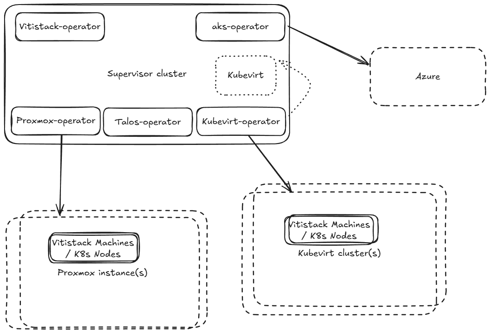

# How to setup vitistack

## Prerequisites
First of all you need a Kubernetes cluster to run all the Vitistack operators.

### On prem
Create hardware nodes an install ex Talos, K0s or other kubernetes solutions

### Cloud
- Azure Kubernetes Service (AKS)
- Elastic Kubernetes Service (EKS)
- Scaleway
- Upcloud
- or others

### Locally
You could use Kind (https://kind.sigs.k8s.io/docs/user/quick-start/#installation) or Talosctl (https://docs.siderolabs.com/talos/v1.11/getting-started/talosctl) to install spin up a Kubernetes cluster locally.


## Visual cluster overview



It is also possible that the supervisor cluster also has Kubevirt installed, so there is also support for only one cluster. But it is wise to spread out the risk onto multiple clusters, incause of errors.

## Install Vitistack CRDS

Using Helm (recommended)

First, login to GitHub Container Registry

Username: your GitHub username

Password: a Personal Access Token (PAT) with `read:packages` scope

Create a PAT at: https://github.com/settings/tokens/new?scopes=read:packages

```bash
helm registry login ghcr.io
helm install vitistack-crds oci://ghcr.io/vitistack/crds
```

Or using kubectl (no authentication required)

```bash
kubectl apply -f https://github.com/vitistack/common/releases/latest/download/crds.yaml
```

## Machine Classes
[Install machineclasses](install-machineclasses.md)

## DHCP

We currently support:

- [Kea DHCP](install-keadhcp.md)

## Vitistack operator

The vitistack operator handles the vitistack crd object. The operator fetches information and adds it to the vitistack crd object, so other solutions could show or integrate with the vitistack. One example is ROR (Release Operate Report) found here: https://github.com/norskHelsenett/ror

Install the vitistack operator by:

```bash
helm install vitistack-operator oci://ghcr.io/vitistack/helm/vitistack-operator
```

## Vitistack Machine Providers
To make vitistack machines, we currently support 

- [Kubevirt](./install-kubevirt.md)
- [Proxmox](./install-proxmox.md)
- [Physical](./install-physical-machine.md)


## Vitistack Kubernetes Providers

To install a vitistack Kubernetes cluster, we currently support

- [Talos](./install-talos.md)

