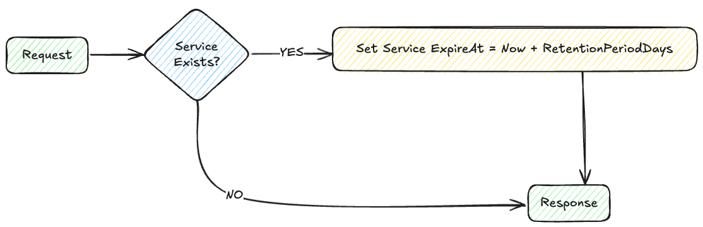

# IPAM-API

## Concept
An API for retrieving ip addresses from Netbox and storing them in MongoDB along with services connected to the ip address.

## IPAM-API Requirements

* Go 1.24+
* MongoDB instance
* NetBox instance and API token

## Netbox Requirements
We use Netbox for controlling zones and which prefixes are available for each zone. 

### Custom Field Choices
* `k8s_zone_choices` is used to define the zones available for the api. These sones are fetched from Netbox and used to validate the request. This custom field should be a select with the valid zones.

### Custom Fields
* `k8s_zone` is the `k8s_zone_choices` selection with valid zones
* `k8s_uuid` is used for the mongodb _id for the registered address

### Prefixes
* `type` needs to be `"container"`
* Custom field `k8s_zone` needs to be added to the prefix
* Custom field `k8s_uuid` needs to be added to the prefix

When `k8s_zone` and `container` is set the prefix is available for IPAM-API

## Environment setup

Create a `config.json`

```json
{
  "mongodb": {
    "username": "Admin",
    "password_path": "mongodb.secret",
    "host": "localhost",
    "port": 27017,
    "database": "vitistack-ipam-api"
  },
  "netbox": {
    "url": "https://netbox.example.com",
    "token_path": "netbox.secret",
    "constraint_tag": "vitistack"
  },
  "splunk": {
    "enable": true,
    "url": "https://splunk-hec.example.com",
    "token_path": "splunk.secret",
    "index": "vitistack",
    "source": "vitistack:ipam-api",
    "sourcetype_app": "ipam-api:app",
    "sourcetype_http": "ipam-api:http"
  },
  "encryption_secrets": {
    "path": "secrets.json"
  }
}
```

## Clone and run

```bash
git clone https://github.com/vitistack/ipam-api.git
cd ipam-api
go mod tidy
go run cmd/ipam-api/main.go
```

## API Endpoints

| Method  | Path         | Description                    |
| ------- | -------------| ------------------------------------------------ |
| `POST`  | `/`          | Register or update a ip address, returns IP      |
| `DELETE`| `/`          | Set expiration for a service for an IP address   |


### Swagger doc
Swagger documentation is available at **ipam-api:3000/swagger/index.html**

### Request Body
```json
{
    "address": "83.118.168.10/32",
    "ip_family": "ipv4",
    "zone": "inet", 
    "secret": "SuperSecret",
    "new_secret": "SuperSecret",
    "service": {
        "service_name": "ingress_inet",
        "namespace_id": "467579ae-b8d5-4524-9ce8-bcb66ee02ce0",
        "cluster_id": "0f3c7805-6b1d-4387-b8c4-b8c5d0e9b878",
        "retention_period_days": 0,
        "deny_external_cleanup": false
    },
}
```
**Top level fields**

| Field                     | Required | Description |
|---------------------------|----------|-------------|
| `address`                 | Optional | Specific IP address to register (must be available in NetBox zone) |
| `ip_family`               | Yes      | IP family, either `"ipv4"` or `"ipv6"` |
| `zone`                    | Yes      | Logical zone (must match a Netbox custom field `k8s_zone`) |
| `secret`                  | Yes      | Unique identifier for the service; used for authentication and tracking |
| `new_secret`              | Optional | If provided, replaces the `secret` after successful update |
| `Service`                 | Yes      | Object containing metadata about the service being registered (see below) |

**Service fields**

| Field                     | Required | Description |
|---------------------------|----------|-------------|
| `service_name`            | Yes      | Name of the service being registered |
| `namespace_id`            | Yes      | UUID of the namespace associated with the service |
| `cluster_id`              | Yes      | UUID of the cluster the service belongs to |
| `retention_period_days`   | Optional | Days to retain the IP even if the service is deleted |
| `deny_external_cleanup`   | Optional | Prevents the IP from being cleaned by external tools |


### Examples
#### Register a service
```bash
curl -X POST http://localhost:3000/ \
  -H "Content-Type: application/json" \
  -d '{
    "address": "83.118.168.10/32",
    "ip_family": "ipv4",
    "zone": "inet",
    "secret": "SuperSecret",
    "service": {
        "service_name": "ingress_inet",
        "namespace_id": "467579ae-b8d5-4524-9ce8-bcb66ee02ce0",
        "cluster_id": "0f3c7805-6b1d-4387-b8c4-b8c5d0e9b878",
        "retention_period_days": 0,
        "deny_external_cleanup": false
    },
}'
```
#### Set expiration for a service
```bash
curl -X DELETE http://localhost:3000/ \
  -H "Content-Type: application/json" \
  -d '{
    "secret": "supersecret",
    "zone": "inet",
    "address": "83.118.168.10/32",
    "ip_family": "ipv4",
    "service": {
        "service_name": "ingress_inet",
        "namespace_id": "467579ae-b8d5-4524-9ce8-bcb66ee02ce0",
        "cluster_id": "0f3c7805-6b1d-4387-b8c4-b8c5d0e9b878",
        "retention_period_days": 0,
        "deny_external_cleanup": false
    },
}'
```

## API Request flows
### POST request


### DELETE request


## IPAM-CLI
The ipam-cli can be used to display or manipulate ip addresses and services stored in MongoDB, and to create a Mongodb dump for backup.

### Build
```bash
go build -o bin/ipam-cli ./cmd/cli
```

### ipam-api help

```
Command-line interface for interacting with the Vitistack IPAM-API.

Usage:
  ipam-cli [flags]
  ipam-cli [command]

Available Commands:
  completion     Generate the autocompletion script for the specified shell
  delete-cluster Set exiresAt == time.Now() for services linked to a cluster id
  delete-service Delete service from address
  help           Help about any command
  mongo-backup   Backup MongoDB data
  replace-secret Replace address secret
  show-secret    Show address secret
  show-services  Show address services
  version        Print the version

Flags:
  -h, --help   help for ipam-cli

Use "ipam-cli [command] --help" for more information about a command.
```

### Examples

#### Show all services for an address
```bash
ipam-cli show-services --zone inet --address 83.118.168.10/32
```

#### Delete cluster
```bash
ipam-cli delete-cluster --cluster-id 0f3c7805-6b1d-4387-b8c4-b8c5d0e9b878
```

#### MongoDump for backup
```bash
ipam-cli mongo-backup --out /backups/ipam-backup.gz
```