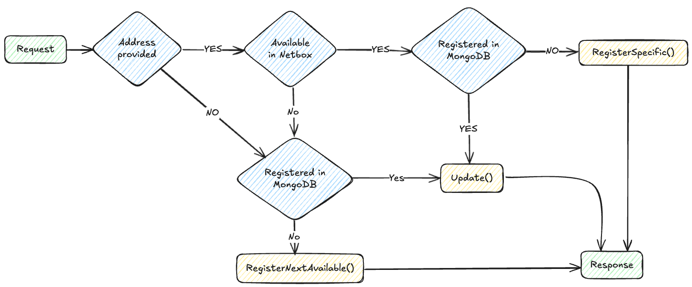

# IPAM-API

## Concept
An API for retrieving ip addresses from Netbox and storing them in MongoDB along with services connected to the ip address.

## IPAM-API Requirements

* Go 1.24+
* MongoDB instance
* NetBox instance and API token

## Netbox Requirements
We use Netbox for controlling zones and which prefixes are available for each zone. 

### Custom Field Choices
* "k8s_zone_choices" is used to define the zones available for the api. These sones are fetch from Netbox and used to validate the request. This should be a select with the valid zones.

### Custom Fields
* "k8s_zone" is the selected zone
* "k8s_uuid" is used for the mongodb _id for the registered address

### Prefixes
* "type" needs to be "container"
* Custom field "k8s_zone" needs to be added to the prefix
* Custom field "k8s_uuid" needs to be added to the prefix

When "k8s_zone" and "container" is set the prefix is available for IPAM-API


## Environment setup

Create a `config.json`

```json
{
  "mongodb": {
    "username": "Admin",
    "password_path": "mongodb.secret",
    "host": "localhost",
    "port": 27017,
    "database": "vitistack-ipam-api"
  },
  "netbox": {
    "url": "https://netbox.example.com",
    "token_path": "netbox.secret",
    "constraint_tag": "vitistack"
  },
  "splunk": {
    "enable": true,
    "url": "https://splunk-hec.example.com",
    "token_path": "splunk.secret",
    "index": "vitistack",
    "source": "vitistack:ipam-api",
    "sourcetype_app": "ipam-api:app",
    "sourcetype_http": "ipam-api:http"
  },
  "encryption_secrets": {
    "path": "secrets.json"
  }
}
```

## Clone and run

```bash
git clone https://github.com/vitistack/ipam-api.git
cd ipam-api
go mod tidy
go run cmd/ipam-api/main.go
```

## API Endpoints

| Method  | Path         | Description                    |
| ------- | -------------| ------------------------------------------------ |
| `POST`  | `/`          | Register or update a ip address, returns IP      |
| `DELETE`| `/`          | Set expiration for a service for an IP address   |


### Swagger doc
Swagger documentation is available at **ipam-api:3000/swagger/index.html**

### Example: Register a service
```bash
curl -X POST http://localhost:3000/ \
  -H "Content-Type: application/json" \
  -d '{
    "address": "83.118.168.10/32",
    "ip_family": "ipv4",
    "zone": "inet",
    "secret": "SuperSecret",
    "service": {
        "service_name": "ingress_inet",
        "namespace_id": "467579ae-b8d5-4524-9ce8-bcb66ee02ce0",
        "cluster_id": "0f3c7805-6b1d-4387-b8c4-b8c5d0e9b878",
        "retention_period_days": 0,
        "deny_external_cleanup": false
    },
}'
```
### Example: Set expiration for a service
```bash
curl -X DELETE http://localhost:3000/ \
  -H "Content-Type: application/json" \
  -d '{
    "secret": "supersecret",
    "zone": "inet",
    "address": "83.118.168.10/32",
    "ip_family": "ipv4",
    "service": {
        "service_name": "ingress_inet",
        "namespace_id": "467579ae-b8d5-4524-9ce8-bcb66ee02ce0",
        "cluster_id": "0f3c7805-6b1d-4387-b8c4-b8c5d0e9b878",
        "retention_period_days": 0,
        "deny_external_cleanup": false
    },
}'
```

## API Request flows
### POST request


### DELETE request
