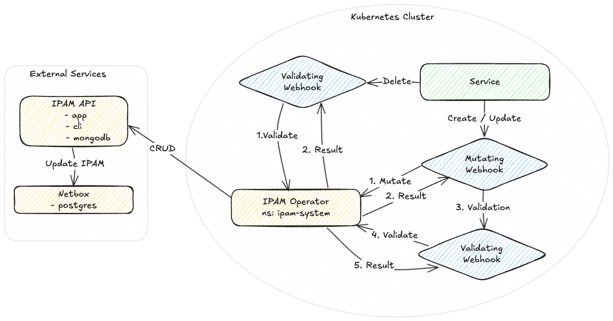
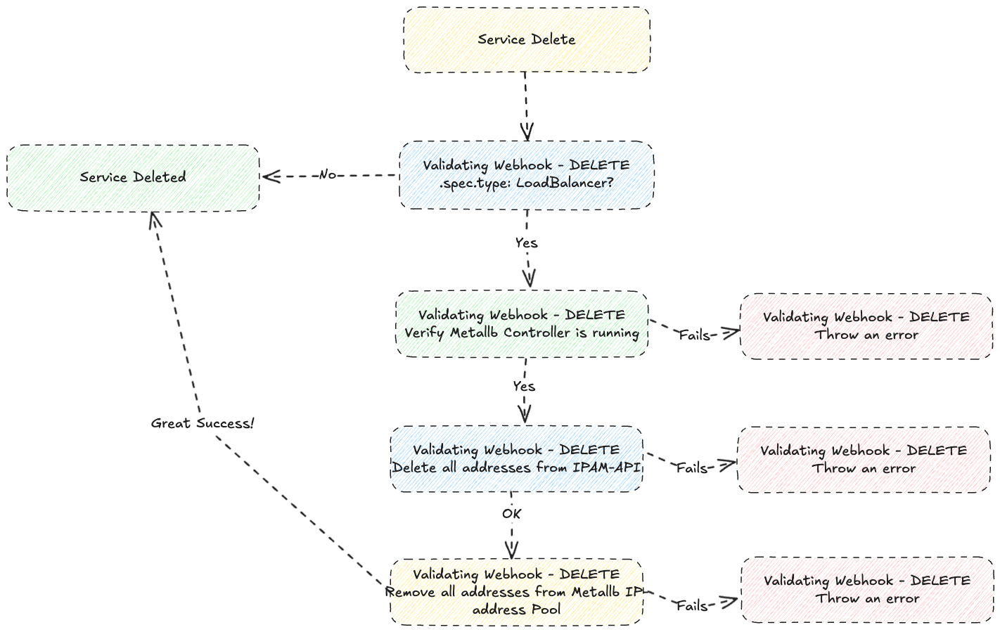

# IPAM-OPERATOR

## Concept

## Service
The only requirement for creating a service is setting .spec.type to **LoadBalancer**.
If kubernetes API is happy with dryRun - f.ex all required kubernetes parameters is valid - the service will be populated with all required default annotations through IPAM-operator.
```yaml
 apiVersion: v1
 kind: Service
 metadata:
   name: my-service
 spec:
   ports:
    - protocol: TCP
      port: 80
      targetPort: 100
   type: LoadBalancer
```

## Annotations
```yaml
apiVersion: v1
kind: Service
metadata:
  annotations:
    ipam.vitistack.io/addresses: 83.118.168.10/32
    ipam.vitistack.io/allow-local-shared-ip: pre-shared-key-sa4OuI3e0o
    ipam.vitistack.io/deny-external-cleanup: "false"
    ipam.vitistack.io/ip-family: ipv4
    ipam.vitistack.io/retention-period-days: "0"
    ipam.vitistack.io/secret: default
    ipam.vitistack.io/zone: inet
```
Lets go through the annotations, one by one:

1. **ipam.vitistack.io/addresses**: Metallb supports only one (1) ip-address pr ip-family. IPAM-operator will fetch ip-address automatically, if not provided manually by consumer. Commas are used to separate multiple addresses.
2. **ipam.vitistack.io/allow-local-shared-ip**: Metallb supports sharing single ip-address between services within same cluster if the pre-shared-key is the same for both services with different ports.
3. **ipam.vitistack.io/deny-external-cleanup**: IPAM-API communicates (one-way) with ROR by using SSE (Server Sent Events), where ROR can send an event to IPAM-API with the cluster UUID to mark all services for a specific cluster to deletion. By toggeling this setting, consumer can prevent ROR from deleting services.
4. **ipam.vitistack.io/ip-family**: IPAM-API supports ipv4, ipv6 & dual keywords. If you would like create a service that only supports ipv6, please make sure that .spec.ipFamilies is set to IPv6 during initial creation.
5. **ipam.vitistack.io/retention-period-days**: Number of days the ip-address should be reserved in IPAM-API before it`s released. You need the secret to re-call the ip-address.
6. **ipam.vitistack.io/secret**: IPAM-operator will create a default secret in namespace ipam-system while serving the first request. The secret is noted as "default" in annotations. Let says you would like to create a anycast service from multiple datacenters. In that case, you need to replace the secret with a opaque secret that exists on all required locations. The opaque secret must be stored in the same namespace as the service. **Note:** The secret cannot be replaced if it´s used by multiple services.
7. **ipam.vitistack.io/zone**: NHN supports three (3) zones for time being: hnet-private, hnet-public & inet. Zone **hnet-public** should be used with caution due to limited addresses in that space.

## Request Body
Key **new_secret** is optional and only required when replacing existing secret!
```json
{
    "address": "83.118.168.10/32",
    "ip_family": "ipv4",
    "zone": "inet",
    "secret": "SuperSecret",
    "new_secret": "SuperSecret",
    "service": {
        "service_name": "ingress_inet",
        "namespace_id": "467579ae-b8d5-4524-9ce8-bcb66ee02ce0",
        "cluster_id": "0f3c7805-6b1d-4387-b8c4-b8c5d0e9b878",
        "retention_period_days": 0,
        "deny_external_cleanup": false
    },
}
```

## Response Body

```json
{
    "message": "IP-address updated!",
    "address": "83.118.168.10/32"
}
```

## Controller Logs

```bash
$ kubectl -n ipam-system logs ipam-controller-manager-7795669cd6-qrnzb
2025-06-23T12:27:08Z    INFO    ipam-operator   Mutation Started for Service    {"name": "my-service"}
2025-06-23T12:27:08Z    INFO    ipam-operator   Dry run .Spec:  {"name": "my-service"}
2025-06-23T12:27:08Z    INFO    ipam-operator   Mutation Started for Service    {"name": "my-service"}
2025-06-23T12:27:08Z    INFO    ipam-operator   Dry run mode detected, skipping mutating for Service:   {"name": "my-service"}
2025-06-23T12:27:08Z    INFO    ipam-operator   Validation Create Started for Service   {"name": "my-service"}
2025-06-23T12:27:08Z    INFO    ipam-operator   Dry run mode detected, skipping validate create for Service:    {"name": "my-service"}
2025-06-23T12:27:08Z    INFO    ipam-operator   Initialized default secret
2025-06-23T12:27:08Z    INFO    ipam-operator   Request IPv4-address for Service:       {"name": "my-service"}
2025-06-23T12:27:08Z    INFO    ipam-operator   Received IPv4-address for Service:      {"name": "my-service", "address": "83.118.168.10"}
2025-06-23T12:27:08Z    INFO    ipam-operator   Mutating Completed for Service  {"name": "my-service"}
2025-06-23T12:27:08Z    INFO    ipam-operator   Validation Create Started for Service   {"name": "my-service"}
2025-06-23T12:27:09Z    INFO    ipam-operator   Validate IP-address succeeded!  {"name": "my-service", "ip": "83.118.168.10"}
2025-06-23T12:27:09Z    INFO    ipam-operator   Validation Create Completed for Service {"name": "my-service"}
```

## model : Service - Overview


## model : Service - Create


## model : Service - Update


## model : Service - Delete
