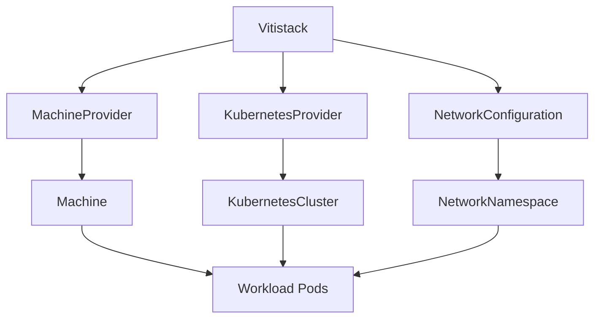

# Custom Resource Definitions (CRDs)

A **CRD (Custom Resource Definition)** is a way to extend Kubernetes by creating your own resource types. It allows you to define and manage custom objects—just like built-in types such as Pod or Service. CRDs are often used to model domain-specific concepts and are commonly paired with operators to automate complex workflows.

## Viti CRDs Overview

The Viti CRDs form the foundation of the Viti infrastructure platform, providing declarative APIs for managing multi-cloud and on-premises resources. These CRDs extend Kubernetes to support comprehensive infrastructure orchestration, from individual machines to complete data centers.

### Repository Information

- **Source**: [github.com/vitistack/crds](https://github.com/vitistack/crds)
- **API Group**: `vitistack.io`
- **Version**: `v1alpha1`
- **License**: Apache 2.0
- **Latest Release**: v0.1.3

## Available CRDs

### Core Infrastructure Resources

#### **Vitistack**
The top-level resource representing a logical data center or infrastructure region.

- **Purpose**: Orchestrate multiple machine and Kubernetes providers within a specific geographical area
- **Capabilities**:

    - Multi-cloud provider coordination (AWS, Azure, GCP, VMware vSphere)
    - Resource management with quotas and limits
    - Network configuration (VPCs, subnets, load balancers, DNS)
    - Security governance and compliance frameworks
    - Monitoring and backup policies
    - Disaster recovery configuration

#### **Machine**
Represents individual compute instances across different infrastructure providers.

- **Purpose**: Declarative management of virtual machines and physical servers
- **Features**:

    - Multi-provider support
    - Resource specifications (CPU, memory, storage)
    - Network configuration
    - Security policies
    - Lifecycle management

#### **MachineProvider**
Defines infrastructure providers that can provision machines.

- **Supported Providers**:

    - Cloud providers (AWS EC2, Azure VMs, Google Compute Engine)
    - Virtualization platforms (VMware vSphere, Proxmox)
    - Physical infrastructure providers
    - Container platforms (KubeVirt)

### Kubernetes Resources

#### **KubernetesCluster**
Represents managed Kubernetes clusters across different platforms.

- **Purpose**: Declarative Kubernetes cluster management
- **Features**:

    - Multi-provider cluster deployment
    - Version management
    - Node pool configuration
    - Add-on management
    - Scaling policies

#### **KubernetesProvider**
Defines Kubernetes service providers and their capabilities.

- **Supported Providers**:

    - Managed services (EKS, AKS, GKE)
    - Self-managed distributions (Talos, RKE2, K3s)
    - On-premises solutions (vSphere with Tanzu, Rancher)

### Networking Resources

#### **NetworkConfiguration**
Defines network policies and configurations across the infrastructure.

- **Features**:

    - VPC and subnet management
    - Load balancer configuration
    - DNS settings
    - Firewall rules and security groups
    - Cross-provider networking

#### **NetworkNamespace**
Provides network isolation and segmentation capabilities.

- **Use Cases**:

    - Multi-tenancy support
    - Environment isolation (dev, staging, production)
    - Compliance and security boundaries
    - Traffic segmentation

## Key Features

### **Multi-Cloud Support**
- **Provider Agnostic**: Work with AWS, Azure, GCP, VMware, and on-premises infrastructure
- **Unified API**: Consistent interface across different cloud providers
- **Provider Prioritization**: Configure preferences and failover between providers

### **Enterprise Security**
- **Compliance Frameworks**: Support for SOC2, ISO27001, and other standards
- **Encryption**: At-rest and in-transit encryption policies
- **Access Control**: RBAC integration with MFA support
- **Audit Logging**: Comprehensive audit trails with configurable retention

### **Resource Management**
- **Quotas and Limits**: Prevent resource over-provisioning
- **Usage Monitoring**: Real-time resource utilization tracking
- **Cost Optimization**: Resource allocation based on cost and performance

### **Operational Excellence**
- **Backup and Recovery**: Automated backup policies with multiple destinations
- **Disaster Recovery**: Cross-region failover capabilities
- **Monitoring Integration**: Built-in observability and alerting
- **GitOps Ready**: Declarative configuration suitable for version control

## Getting Started

### Installation
```bash
# Generate CRDs
make manifests

# Install CRDs into your cluster
make install-crds

# Verify installation
kubectl get crd | grep vitistack.io
```

### Basic Usage
```bash
# Apply example configurations
kubectl apply -f examples/machine-example.yaml
kubectl apply -f examples/kubernetes-provider-example.yaml

# List resources
kubectl get vitistacks
kubectl get machines
kubectl get kubernetesclusters
```

### Go Integration
```go
import (
    v1alpha1 "github.com/vitistack/crds/pkg/v1alpha1"
    unstructuredutil "github.com/vitistack/crds/pkg/unstructuredutil"
    "k8s.io/apimachinery/pkg/runtime"
)

// Create typed client
var scheme = runtime.NewScheme()
_ = v1alpha1.AddToScheme(scheme)

// Use typed resources
m := &v1alpha1.Machine{
    // configure machine spec
}

// Convert to unstructured for dynamic clients
u, err := unstructuredutil.MachineToUnstructured(m)
```

## Development and Contribution

### Prerequisites
- Go 1.25+
- make, kubectl
- Access to a Kubernetes cluster

### Common Development Tasks
```bash
# Generate code and CRDs
make generate

# Format, vet, and lint
make fmt && make vet && make lint

# Run tests
make test

# Security scanning
make go-security-scan

# Update dependencies
make update-deps
```

### CRD Structure

All CRDs follow consistent patterns:

- **API Group**: `vitistack.io`
- **Version**: `v1alpha1` (evolving towards v1beta1, then v1)
- **Validation**: Comprehensive OpenAPI v3 schema validation
- **Status Reporting**: Rich status information with conditions and phases
- **Printer Columns**: User-friendly `kubectl get` output

## Architecture Integration

The Viti CRDs are designed to work together as a cohesive system:



### Operator Integration
The CRDs are managed by corresponding operators:
- **Vitistack Operator**: Manages overall infrastructure orchestration
- **Machine Operators**: Provider-specific machine management (Proxmox, Talos, KubeVirt, Physical)
- **Network Operators**: IPAM and network policy management

## Best Practices

### **Resource Organization**
- Use namespaces to separate environments and tenants
- Apply consistent labeling and tagging strategies
- Implement proper RBAC for CRD access

### **Configuration Management**
- Store CRD definitions in version control (GitOps)
- Use Helm charts or Kustomize for templating
- Implement proper backup and disaster recovery for configurations

### **Monitoring and Observability**
- Monitor CRD status and conditions
- Set up alerts for resource quota thresholds
- Track resource utilization and costs

### **Security**
- Enable encryption for sensitive data
- Implement compliance frameworks appropriate for your industry
- Regularly audit access patterns and permissions

## Documentation and Support

### **Detailed Documentation**
Each CRD has comprehensive documentation:

- [Vitistack CRD Documentation](https://github.com/vitistack/crds/blob/main/docs/vitistack-crd.md)
- [Machine CRD Documentation](https://github.com/vitistack/crds/blob/main/docs/machine-crd.md)
- [MachineProvider CRD Documentation](https://github.com/vitistack/crds/blob/main/docs/machine-provider-crd.md)
- [KubernetesProvider CRD Documentation](https://github.com/vitistack/crds/blob/main/docs/kubernetes-provider-crd.md)

### **Additional Resources**
- [Architecture Overview](https://github.com/vitistack/crds/blob/main/docs/architecture.md)
- [API Reference](https://github.com/vitistack/crds/blob/main/docs/api-reference.md)
- [Operational Guide](https://github.com/vitistack/crds/blob/main/docs/operational-guide.md)
- [Performance Optimization](https://github.com/vitistack/crds/blob/main/docs/performance-optimization.md)

The Viti CRDs provide a powerful, unified API for managing complex, multi-cloud infrastructure declaratively within Kubernetes, enabling true infrastructure-as-code at enterprise scale.