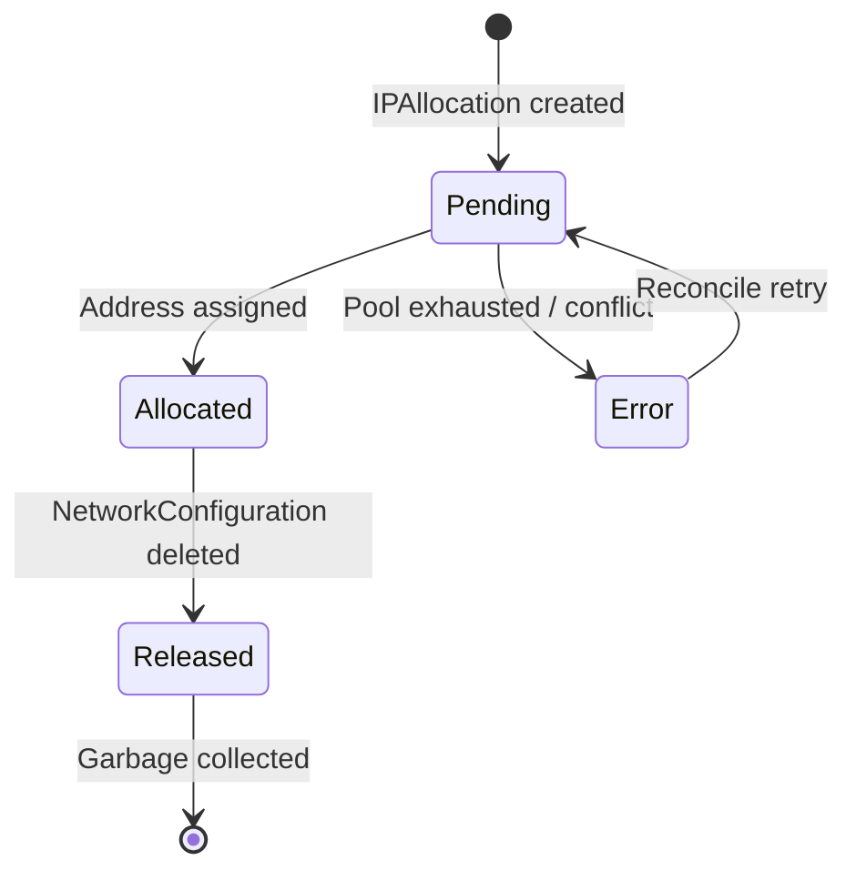

# IPAllocation

The IPAllocation CRD represents a single IP address allocation within a [NetworkNamespace](networknamespace.md). It replaces the inline allocatedIPs array from v1alpha1, making each allocation a first-class Kubernetes resource with its own lifecycle.

## API Version

| Version | Status |
|---------|--------|
| vitistack.io/v1alpha2 | Current |

!!! info "New in v1alpha2"
    IPAllocation is a new resource introduced in v1alpha2. It does not exist in v1alpha1.

## Design Principles

- **One resource per allocation** — Each IP address gets its own IPAllocation CR, enabling fine-grained status tracking and garbage collection.
- **Owner references** — Each IPAllocation is owned (via ownerReferences) by its parent NetworkConfiguration, so it is automatically garbage-collected when the NC is deleted.
- **Label-based lookups** — Standard labels enable efficient listing by NetworkNamespace or NetworkConfiguration without scanning all resources.

## Resource Definition

```yaml
apiVersion: vitistack.io/v1alpha2
kind: IPAllocation
metadata:
  name: string
  namespace: string
  labels:
    vitistack.io/network-namespace: string       # Parent NetworkNamespace name
    vitistack.io/network-configuration: string   # Parent NetworkConfiguration name
  ownerReferences:
    - apiVersion: vitistack.io/v1alpha1
      kind: NetworkConfiguration
      name: string
      uid: string
spec:
  networkNamespaceName: string           # Required. NetworkNamespace this belongs to
  networkConfigurationName: string       # Required. NetworkConfiguration that requested it
  interfaceName: string                  # Optional. NIC name for multi-NIC VMs
  requestedAddress: string               # Optional. Preferred IP address

status:
  phase: Pending | Allocated | Released | Error
  address: string                        # Allocated IPv4 address
  gateway: string                        # Gateway for the subnet
  prefix: int                            # CIDR prefix length (e.g. 24)
  vlanId: int                            # VLAN ID
  dns: []string                          # DNS server addresses
  expiresAt: timestamp                   # TTL expiry (for static with TTL)
  message: string                        # Human-readable status detail
```

## Lifecycle



| Phase | Description |
|-------|-------------|
| Pending | Allocation requested but not yet fulfilled. |
| Allocated | IP address successfully assigned. status.address is populated. |
| Released | The allocation has been released (NC deleted). Will be garbage-collected. |
| Error | Allocation failed. See status.message for details. |

## Usage Examples

### Typical Allocation (created by static-ip-operator)

```yaml
apiVersion: vitistack.io/v1alpha2
kind: IPAllocation
metadata:
  name: web-server-01-eth0
  namespace: datacenter-01
  labels:
    vitistack.io/network-namespace: prod-network
    vitistack.io/network-configuration: web-server-01
  ownerReferences:
    - apiVersion: vitistack.io/v1alpha1
      kind: NetworkConfiguration
      name: web-server-01
      uid: "abc-123"
spec:
  networkNamespaceName: prod-network
  networkConfigurationName: web-server-01
  interfaceName: eth0
status:
  phase: Allocated
  address: "10.0.2.50"
  gateway: "10.0.2.1"
  prefix: 24
  vlanId: 100
  dns:
    - "8.8.8.8"
    - "8.8.4.4"
  expiresAt: "2026-05-19T10:00:00Z"
```

### Requesting a Specific Address

```yaml
apiVersion: vitistack.io/v1alpha2
kind: IPAllocation
metadata:
  name: db-server-fixed
  namespace: datacenter-01
  labels:
    vitistack.io/network-namespace: prod-network
    vitistack.io/network-configuration: db-server-01
spec:
  networkNamespaceName: prod-network
  networkConfigurationName: db-server-01
  requestedAddress: "10.0.2.100"
```

The allocator will honor the request if the address is within the pool range and not already allocated.

## Labels

IPAllocation resources carry standard labels for efficient querying:

| Label | Purpose | Example |
|-------|---------|---------|
| vitistack.io/network-namespace | Parent NetworkNamespace | prod-network |
| vitistack.io/network-configuration | Parent NetworkConfiguration | web-server-01 |

### Listing Allocations by NetworkNamespace

```bash
kubectl get ipallocations -l vitistack.io/network-namespace=prod-network
```

### Listing Allocations by NetworkConfiguration

```bash
kubectl get ipallocations -l vitistack.io/network-configuration=web-server-01
```

## Print Columns

```
NAME                ADDRESS      NETWORKNAMESPACE   NETWORKCONFIGURATION   PHASE       AGE
web-server-01-eth0  10.0.2.50    prod-network       web-server-01          Allocated   5m
db-server-fixed     10.0.2.100   prod-network       db-server-01           Allocated   3m
new-server-eth0     <none>       prod-network       new-server             Pending     10s
```

## Operator Responsibilities

### static-ip-operator

Creates and manages IPAllocation resources for NetworkNamespaces with ipAllocation.type: static:

1. Watches NetworkConfiguration resources
2. When a NC references a NetworkNamespace with static allocation, creates an IPAllocation CR
3. Allocates the next available IP from the pool (or the requested address)
4. Updates status.phase to Allocated with the assigned address details
5. Handles TTL expiry and re-allocation

### kea-operator

Does **not** create IPAllocation resources. DHCP-based allocations are managed by the Kea DHCP server directly. The aggregate counts in NetworkNamespace.status.ipAllocationSummary are computed from Kea lease data.

## Relationship to NetworkNamespace

The IPAllocationSummary in NetworkNamespace.status provides aggregate counts computed from individual IPAllocation resources:

```yaml
# NetworkNamespace status (computed projection)
status:
  ipAllocationSummary:
    type: static
    provider: static-ip-operator
    allocatedCount: 15
    availableCount: 235
    totalCount: 250
```

This is a read-only projection — the source of truth is the set of IPAllocation CRs.

## Related Resources

- [NetworkNamespace](networknamespace.md) — The network segment that contains the IP pool
- [NetworkConfiguration](../operators/kea-operator.md) — Machine network interface that triggers allocation
