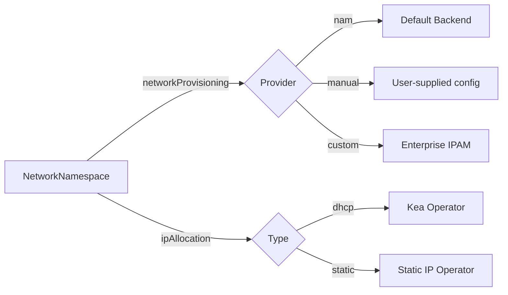
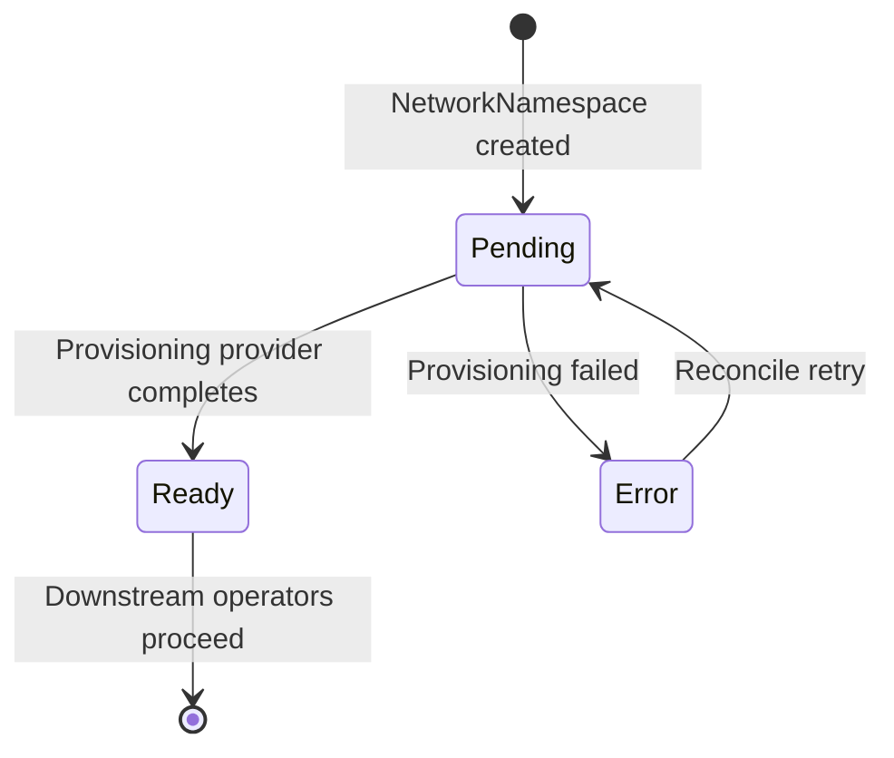

# NetworkNamespace

The NetworkNamespace CRD defines a network isolation boundary within a Viti Stack datacenter. It represents a logical network segment with its own IP prefix, VLAN, and provisioning lifecycle.

## API Versions

| Version | Status | Storage |
|---------|--------|--------|
| v1alpha2 | Current | Yes (storage version) |
| v1alpha1 | Deprecated | No (served via conversion webhook) |

!!! info "Conversion Webhook"
    A standalone conversion webhook (deployed with the vitistack-crds Helm chart) handles transparent conversion between v1alpha1 and v1alpha2. Existing v1alpha1 clients continue to work without modification.

## Key Concepts (v1alpha2)

v1alpha2 introduces a clear separation between two concerns:

1. **Network Provisioning** — _Where does the IP prefix and VLAN come from?_
2. **IP Allocation** — _How are individual IPs assigned to machines within that network?_

This separation enables pluggable provisioning backends (NAM or manual) independent of the IP allocation strategy (DHCP or static).



## Resource Definition

```yaml
apiVersion: vitistack.io/v1alpha2
kind: NetworkNamespace
metadata:
  name: string
  namespace: string
spec:
  datacenterIdentifier: string        # Required. Datacenter ID (e.g. "no-west-az1")
  supervisorIdentifier: string        # Required. Unique name per datacenter

  networkProvisioning:                # Optional. Defaults to NAM
    provider: nam | manual            # Network segment source
    nam: {}                           # Reserved for future NAM overrides
    manual:                           # Required when provider=manual
      ipv4CIDR: string               # Subnet in CIDR notation
      ipv4Gateway: string            # Default gateway
      ipv6CIDR: string               # IPv6 subnet (optional)
      vlanId: int                    # VLAN ID (0-4094)

  ipAllocation:                       # Optional. Defaults to DHCP
    type: dhcp | static              # IP allocation method
    provider: string                 # Operator name (e.g. "kea", "static-ip-operator")
    static:                          # Required when type=static
      ipv4CIDR: string              # Pool subnet
      ipv4Gateway: string           # Gateway
      ipv4RangeStart: string        # First allocatable IP
      ipv4RangeEnd: string          # Last allocatable IP
      vlanId: int                   # VLAN ID
      dns: []string                 # DNS servers
      ttlSeconds: int               # Allocation TTL (default: 3600)
    dhcp:                            # Optional DHCP overrides
      requireClientClasses: []string # Kea client classes

status:
  provisioningPhase: Pending | Ready | Error  # Network provisioning state
  phase: string                       # Overall lifecycle phase
  status: string                      # Human-readable status
  message: string                     # Detail message
  created: timestamp                  # Creation time
  observedGeneration: int             # Last observed generation
  retryCount: int                     # Retry attempts

  # Provisioned network details (populated by provisioning provider)
  datacenterIdentifier: string
  supervisorIdentifier: string
  namespaceId: string                 # External namespace ID
  ipv4Prefix: string                  # Allocated IPv4 prefix
  ipv6Prefix: string                  # Allocated IPv6 prefix
  ipv4EgressIp: string               # Egress IPv4 address
  ipv6EgressIp: string               # Egress IPv6 address
  vlanId: int                         # Assigned VLAN ID
  associatedKubernetesClusterIds: []string

  ipAllocationSummary:                # Aggregate IP allocation state
    type: dhcp | static
    provider: string
    allocatedCount: int
    availableCount: int
    totalCount: int

  conditions: []Condition             # Standard Kubernetes conditions
```

## Provisioning Providers

The networkProvisioning.provider field selects which backend provisions the network segment. The architecture is extensible — any operator that watches NetworkNamespace resources and sets status.provisioningPhase: Ready can serve as a provisioning provider.

### Built-in Providers

| Provider | Description |
|----------|-------------|
| nam | Default. Internal network provisioning backend. |
| manual | User-supplied network configuration (no external system). |

### Enterprise IPAM Integration

The provisioning provider model is designed to support enterprise IPAM integrations (e.g. Infoblox, NetBox, phpIPAM, Bluecat). To build a custom IPAM provisioning operator:

1. **Watch** NetworkNamespace resources where spec.networkProvisioning.provider matches your operator's name
2. **Allocate** an IP prefix and VLAN from your IPAM system using the datacenterIdentifier and supervisorIdentifier as context
3. **Populate** status fields: ipv4Prefix, ipv6Prefix, vlanId, namespaceId
4. **Set** status.provisioningPhase: Ready to ungate downstream IP allocation operators

```go
// Skeleton reconciler for a custom IPAM provisioning operator
func (r *Reconciler) Reconcile(ctx context.Context, req ctrl.Request) (ctrl.Result, error) {
    nn := &v1alpha2.NetworkNamespace{}
    if err := r.Get(ctx, req.NamespacedName, nn); err != nil {
        return ctrl.Result{}, client.IgnoreNotFound(err)
    }

    // Only handle our provider
    if nn.Spec.NetworkProvisioning == nil || 
       nn.Spec.NetworkProvisioning.Provider != "my-ipam" {
        return ctrl.Result{}, nil
    }

    // Call external IPAM API
    prefix, vlan, err := r.IPAMClient.AllocatePrefix(ctx, 
        nn.Spec.DatacenterIdentifier, 
        nn.Spec.SupervisorIdentifier)
    if err != nil {
        nn.Status.ProvisioningPhase = v1alpha2.ProvisioningPhaseError
        nn.Status.Message = err.Error()
        return ctrl.Result{}, r.Status().Update(ctx, nn)
    }

    // Populate status
    nn.Status.IPv4Prefix = prefix.IPv4CIDR
    nn.Status.VlanID = vlan.ID
    nn.Status.ProvisioningPhase = v1alpha2.ProvisioningPhaseReady
    return ctrl.Result{}, r.Status().Update(ctx, nn)
}
```

To register a custom provider, add your enum value to the NetworkProvisioningType validation in the CRD schema and deploy your operator alongside the vitistack-crds chart.

### NAM Provider — Default

The default provisioning backend. When networkProvisioning is omitted or set to provider: nam, the nms-operator handles network segment provisioning.

```yaml
apiVersion: vitistack.io/v1alpha2
kind: NetworkNamespace
metadata:
  name: prod-network
  namespace: datacenter-01
spec:
  datacenterIdentifier: no-west-az1
  supervisorIdentifier: sv-01
  # networkProvisioning is omitted → defaults to nam
  ipAllocation:
    type: dhcp
    provider: kea
```

### Manual Provisioning

Manual provisioning allows operators to supply network configuration directly. This is useful for environments where IP prefixes and VLANs are managed externally or by a separate team.

The manual-ip-provisioning-operator watches for NetworkNamespace resources with provider: manual and sets provisioningPhase: Ready after populating status fields from the manual config.

```yaml
apiVersion: vitistack.io/v1alpha2
kind: NetworkNamespace
metadata:
  name: manual-network
  namespace: datacenter-01
spec:
  datacenterIdentifier: no-west-az1
  supervisorIdentifier: sv-01
  networkProvisioning:
    provider: manual
    manual:
      ipv4CIDR: "10.0.2.0/24"
      ipv4Gateway: "10.0.2.1"
      vlanId: 100
  ipAllocation:
    type: static
    provider: static-ip-operator
    static:
      ipv4CIDR: "10.0.2.0/24"
      ipv4Gateway: "10.0.2.1"
      ipv4RangeStart: "10.0.2.10"
      ipv4RangeEnd: "10.0.2.250"
      vlanId: 100
      dns:
        - "8.8.8.8"
        - "8.8.4.4"
      ttlSeconds: 7200
```

## Provisioning Phase Lifecycle

The status.provisioningPhase field gates downstream operators:



| Phase | Description |
|-------|-------------|
| Pending | Network segment is being provisioned. Downstream operators must wait. |
| Ready | Network is provisioned. IP allocation operators may begin allocating. |
| Error | Provisioning failed. Check status.message for details. |

!!! warning "Downstream Gating"
    Operators such as kea-operator and static-ip-operator **must not** act on a NetworkNamespace until provisioningPhase is Ready. This prevents race conditions where IP allocation starts before the network segment exists.

## IP Allocation Types

### DHCP Allocation

Uses an external DHCP server (typically Kea) for dynamic address assignment:

```yaml
spec:
  ipAllocation:
    type: dhcp
    provider: kea
    dhcp:
      requireClientClasses:
        - "vitistack"
```

The kea-operator configures Kea DHCP subnets and pools based on the provisioned network details in status.

### Static Allocation

Uses the static-ip-operator to allocate individual IP addresses from a defined range. Each allocation is tracked as an [IPAllocation](ipallocation.md) resource.

```yaml
spec:
  ipAllocation:
    type: static
    provider: static-ip-operator
    static:
      ipv4CIDR: "10.0.2.0/24"
      ipv4Gateway: "10.0.2.1"
      ipv4RangeStart: "10.0.2.10"
      ipv4RangeEnd: "10.0.2.250"
      vlanId: 100
      dns:
        - "10.0.2.1"
      ttlSeconds: 3600
```

## Validation

| Field | Rule | Example |
|-------|------|---------|
| spec.datacenterIdentifier | 2-32 chars, ^[A-Za-z0-9_-]+$ | no-west-az1 |
| spec.supervisorIdentifier | 2-32 chars, ^[A-Za-z0-9_-]+$ | sv-01 |
| spec.networkProvisioning.provider | Enum: nam, manual | manual |
| spec.ipAllocation.type | Enum: dhcp, static | static |
| spec.ipAllocation.provider | 0-32 chars, ^[A-Za-z0-9_-]+$ | kea |
| spec.networkProvisioning.manual.ipv4CIDR | Valid CIDR pattern | 10.0.2.0/24 |
| spec.networkProvisioning.manual.vlanId | 0-4094 | 100 |
| spec.ipAllocation.static.ttlSeconds | Minimum 60, default 3600 | 7200 |

## v1alpha1 Compatibility

The conversion webhook transparently maps between v1alpha1 and v1alpha2:

| v1alpha1 Field | v1alpha2 Equivalent |
|----------------|---------------------|
| spec.ipAllocation (with static + inline network) | spec.networkProvisioning.manual + spec.ipAllocation |
| spec.ipAllocation (DHCP or unset) | spec.networkProvisioning.provider: nam |
| status.provisioningPhase (string) | status.provisioningPhase (typed enum) |
| status.ipAllocationStatus | status.ipAllocationSummary |
| status.ipAllocationStatus.allocatedIPs | Removed — tracked in individual [IPAllocation](ipallocation.md) CRs |

!!! note "Breaking Changes"
    v1alpha2 removes status.ipAllocationStatus.allocatedIPs (the list of individual allocations). These are now first-class resources tracked as IPAllocation CRDs. The aggregate counts remain in status.ipAllocationSummary.

## Print Columns

```
NAME           PROVISIONING   DATACENTERIDENTIFIER   PROVISIONINGPHASE   PHASE   STATUS   CREATED
prod-network   nam            no-west-az1            Ready               Active  OK       2026-05-18T10:00:00Z
manual-net     manual         no-west-az1            Ready               Active  OK       2026-05-18T11:00:00Z
```

## Related Resources

- [IPAllocation](ipallocation.md) — Individual IP address allocations within a NetworkNamespace
- [NetworkConfiguration](../operators/kea-operator.md) — Machine network interface configuration referencing a NetworkNamespace
