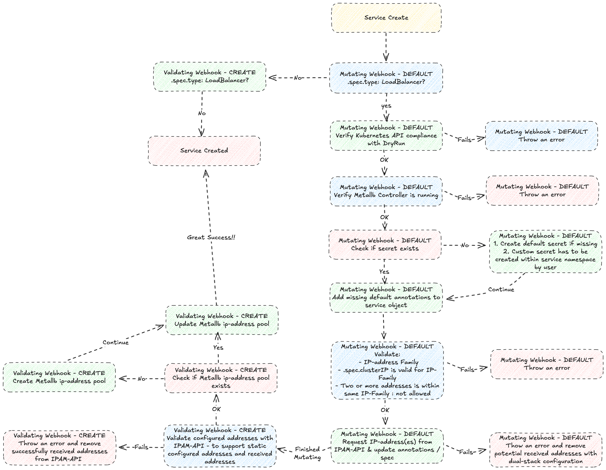
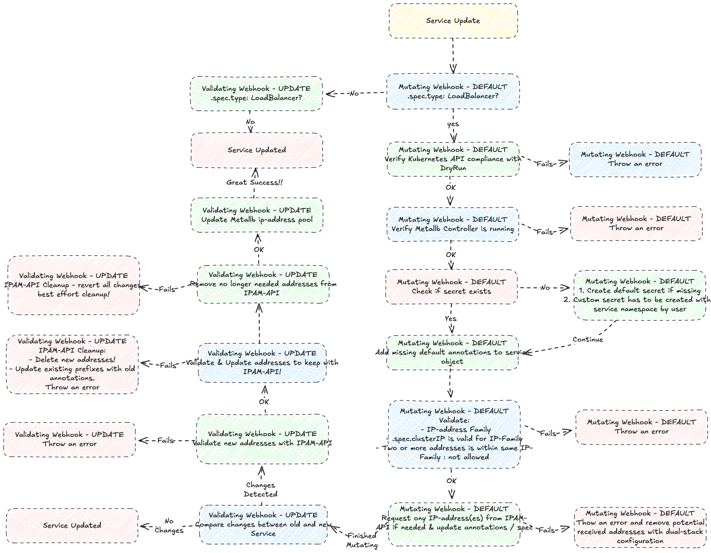

# IPAM-OPERATOR

## Concept
The IPAM-operator (IP Address Management operator) plays a critical role in managing IP addresses for services within healthcare network and internet.

IPAM-operator depends on:

1. **cert-manager** (https://cert-manager.io) to assign certificate to Admission Webhook components
2. **MetalLB** (https://metallb.io) to expose the service outside the cluster
3. **IPAM-API** (https://github.com/vitistack/ipam-api) for requesting ip-addresses

IPAM-operator is built upon framework Kubebuilder for writing controllers and operators in a structured and standardized way.

## Service
IPAM-operator will assign default IPAM annotations to the service object during create & update process. However, you may configure those values manually by choice!
IPAM annotations require that end-user set `.spec.type` to `LoadBalancer`.
If kubernetes API is happy with dryRun - f.ex all required kubernetes parameters is valid - the service will be populated with all required default annotations through IPAM-operator.
```yaml
 apiVersion: v1
 kind: Service
 metadata:
   name: my-service
   namespace: services
 spec:
   ports:
    - protocol: TCP
      port: 80
      targetPort: 100
   type: LoadBalancer
```

## Annotations
```yaml
apiVersion: v1
kind: Service
metadata:
  annotations:
    ipam.vitistack.io/addresses: 83.118.168.10/32
    ipam.vitistack.io/allow-local-shared-ip: pre-shared-key-sa4OuI3e0o
    ipam.vitistack.io/deny-external-cleanup: "false"
    ipam.vitistack.io/ip-family: ipv4
    ipam.vitistack.io/retention-period-days: "0"
    ipam.vitistack.io/secret: default
    ipam.vitistack.io/zone: inet
```
Let´s go through the annotations, one by one:

- **ipam.vitistack.io/addresses**: Metallb support only one (1) ip-address pr ip-family. IPAM-operator will fetch ip-address automatically, if not provided manually by consumer. Commas are used to separate multiple addresses.
- **ipam.vitistack.io/allow-local-shared-ip**: Metallb support sharing single ip-address between services within same cluster if the pre-shared-key is the same for both services with different ports.
- **ipam.vitistack.io/deny-external-cleanup**: IPAM-API initiate communication (one-way) with ROR to support **SSE** (Server Sent Events), where ROR can send an event to IPAM-API with the cluster UUID to mark all services for a specific cluster to deletion. By toggeling this setting, consumer can prevent ROR from deleting services.
- **ipam.vitistack.io/ip-family**: IPAM-API supports `ipv4`, `ipv6` & `dual` keywords. If you would like create a service that only supports ipv6, please make sure that `.spec.ipFamilies` is set to `IPv6` during initial creation.
- **ipam.vitistack.io/retention-period-days**: Number of days the service should be reserved in IPAM-API before it`s deleted. You need the secret to re-call the ip-address.
- **ipam.vitistack.io/secret**: IPAM-operator will create a default secret in namespace ipam-system while serving the first request. The secret is noted as "default" in annotations. Let say you would like to create an anycast service from multiple datacenters. In that case, you need to replace the secret with a opaque secret that exists on all required locations. The opaque secret must be stored in the same namespace as the service. **Note:** The secret cannot be replaced if it´s used by multiple services.
```yaml
apiVersion: v1
kind: Secret
metadata:
 name: my-secret
 namespace: services
type: Opaque
data:
 secret: bXktYXdlc29tZS1wYXNzd29yZA==
```
- **ipam.vitistack.io/zone**: NHN supports three (3) zones for the time being:
    - `hnet-private` - healthcare network - supports only ipv4-family - f.ex 10.0.0.0/8 & 172.16.0.0/12
    - `hnet-public` - healthcare network - supports only ipv4-family - f.ex 83.118.128.0/22 & 91.186.80/20
        - zone `hnet-public` should be used with caution due to limited addresses in that space.
    - `inet` - internet - supports both ipv4- & ipv6-family

## Request Body
IPAM-API has no authentication methods available, hence not needed.
The person who holds the secret, owns the ip-address. Multiple services can consume the same ip-address as long as the secret matches. Each service will be added as a dependency to the ip-address. The ip-address will be released when dependencies no longer exists.
Key `new_secret` is optional and only required when replacing existing secret!
```json
{
    "address": "83.118.168.10/32",
    "ip_family": "ipv4",
    "zone": "inet",
    "secret": "SuperSecret",
    "new_secret": "SuperSecret",
    "service": {
        "service_name": "ingress_inet",
        "namespace_id": "467579ae-b8d5-4524-9ce8-bcb66ee02ce0",
        "cluster_id": "0f3c7805-6b1d-4387-b8c4-b8c5d0e9b878",
        "retention_period_days": 0,
        "deny_external_cleanup": false
    },
}
```

## Response Body

```json
{
    "message": "IP-address updated!",
    "address": "83.118.168.10/32"
}
```

## Controller Logs
Admission Webhook has a default timeout of `10 seconds`. We have configured the timeout to `30 seconds`, which is the maximum allowed value.
A "webhook timeout exceeded" error in Kubernetes, indicates that the Kubernetes API server couldn´t get a response from the webhook within the configured timeout period. Before drawing any conclusion, please verify the logs in IPAM-controller!
```bash
$ kubectl -n ipam-system logs ipam-controller-manager-7795669cd6-qrnzb
2025-06-23T12:27:08Z    INFO    ipam-operator   Mutation Started for Service    {"name": "my-service"}
2025-06-23T12:27:08Z    INFO    ipam-operator   Dry run .Spec:  {"name": "my-service"}
2025-06-23T12:27:08Z    INFO    ipam-operator   Mutation Started for Service    {"name": "my-service"}
2025-06-23T12:27:08Z    INFO    ipam-operator   Dry run mode detected, skipping mutating for Service:   {"name": "my-service"}
2025-06-23T12:27:08Z    INFO    ipam-operator   Validation Create Started for Service   {"name": "my-service"}
2025-06-23T12:27:08Z    INFO    ipam-operator   Dry run mode detected, skipping validate create for Service:    {"name": "my-service"}
2025-06-23T12:27:08Z    INFO    ipam-operator   Initialized default secret
2025-06-23T12:27:08Z    INFO    ipam-operator   Request IPv4-address for Service:       {"name": "my-service"}
2025-06-23T12:27:08Z    INFO    ipam-operator   Received IPv4-address for Service:      {"name": "my-service", "address": "83.118.168.10"}
2025-06-23T12:27:08Z    INFO    ipam-operator   Mutating Completed for Service  {"name": "my-service"}
2025-06-23T12:27:08Z    INFO    ipam-operator   Validation Create Started for Service   {"name": "my-service"}
2025-06-23T12:27:09Z    INFO    ipam-operator   Validate IP-address succeeded!  {"name": "my-service", "ip": "83.118.168.10"}
2025-06-23T12:27:09Z    INFO    ipam-operator   Validation Create Completed for Service {"name": "my-service"}
```

## Splunk
IPAM-API forwards all HTTP & APP events to Splunk HEC.


## model : Service - Overview


## model : Service - Create


## model : Service - Update


## model : Service - Delete
