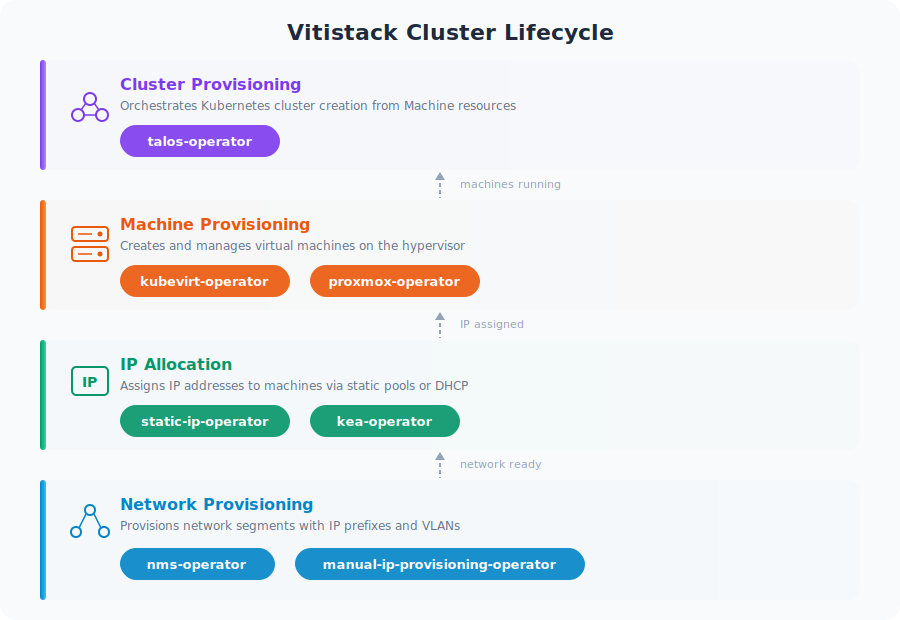

# Operators

Viti Stack is composed of independent operators that each own a specific stage of the infrastructure lifecycle. The operators are designed to be loosely coupled — each watches specific CRDs and gates its work on upstream status fields, forming a pipeline from network provisioning through to running Kubernetes clusters.

## Operator Lifecycle

## Layers

### Layer 1 — Network Provisioning

Provisions network segments (IP prefixes, VLANs) from an upstream source. Exactly one provisioning operator acts per NetworkNamespace, selected by the spec.networkProvisioning.provider field.

| Operator | Provider | Description |
|----------|----------|-------------|
| [nms-operator](vitistack-operator.md) | nam (default) | Allocates network segments from the Network Automation Manager API |
| [manual-ip-provisioning-operator](manual-ip-provisioning-operator.md) | manual | Copies user-supplied network parameters from spec to status |

**Input:** NetworkNamespace created
**Output:** NetworkNamespace.status.provisioningPhase = Ready, with ipv4Prefix, vlanId, and gateway populated

### Layer 2 — IP Allocation

Assigns individual IP addresses to machines. Gated on provisioningPhase: Ready — these operators do not act until Layer 1 completes. The allocation method is selected by spec.ipAllocation.type on the NetworkNamespace.

| Operator | Allocation Type | Description |
|----------|----------------|-------------|
| [static-ip-operator](ipam-operator.md) | static | Allocates IPs from a defined range, tracked as IPAllocation CRs |
| [kea-operator](kea-operator.md) | dhcp | Manages DHCP reservations in ISC Kea |

**Input:** NetworkNamespace with provisioningPhase: Ready + NetworkConfiguration with MAC address
**Output:** IPAllocation with status.phase = Allocated (static) or DHCP lease (dhcp)

### Layer 3 — Machine Provisioning

Creates and manages virtual machines on the underlying hypervisor. Machines reference a MachineProvider that selects which operator handles them.

| Operator | Provider Type | Description |
|----------|--------------|-------------|
| [kubevirt-operator](kubevirt-operator.md) | kubevirt | Creates KubeVirt VirtualMachine resources, manages storage and cloud-init |
| [proxmox-operator](proxmox-operator.md) | proxmox | Creates Proxmox VMs via the Proxmox API |

**Input:** Machine CR with providerRef and NetworkConfiguration with assigned IP
**Output:** Machine.status.phase = Running

### Layer 4 — Cluster Provisioning

Orchestrates Kubernetes cluster creation by generating Machine manifests and coordinating the bootstrap process.

| Operator | Description |
|----------|-------------|
| [talos-operator](talos-operator.md) | Generates Machine CRs from KubernetesCluster spec, manages Talos configuration and cluster bootstrap |

**Input:** KubernetesCluster CR with desired topology
**Output:** Running Kubernetes cluster with control plane and worker nodes

### Layer 5 — Observability

Cross-cutting monitoring that watches resources across all layers.

| Component | Description |
|-----------|-------------|
| kubevirt-status-page | Real-time web UI showing KubeVirt nodes, VMs, and cluster allocation via SSE |