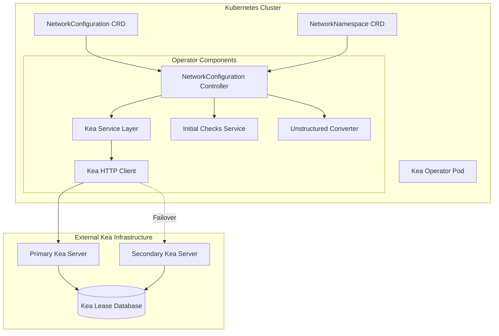
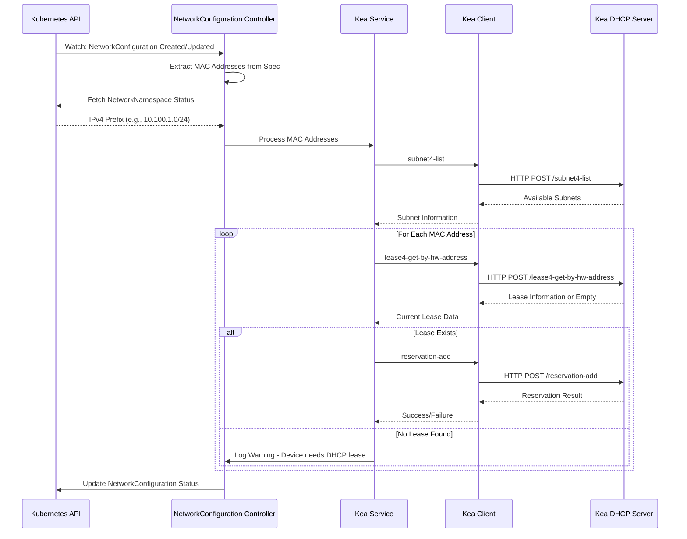

# Kea Operator

!!! warning "Work in progress!"

The Kea Operator is a specialized Kubernetes operator that manages ISC Kea DHCP server reservations based on Viti network configurations. It automatically ensures that devices with known MAC addresses receive consistent IP addresses by creating and managing DHCP reservations in Kea DHCP servers.

## How the Kea Operator Works - Overview

The Kea Operator functions as a bridge between Kubernetes-native network configuration and ISC Kea DHCP servers, automating the creation and management of IP address reservations. Here's how it operates:

### **Core Workflow**

1. **Watches NetworkConfiguration CRDs**: The operator continuously monitors Kubernetes for `NetworkConfiguration` resources that contain MAC address specifications in their `spec.networkInterfaces[]` fields.

2. **Discovers Network Context**: For each NetworkConfiguration, it retrieves the associated `NetworkNamespace` to obtain the IPv4 network prefix (e.g., `10.100.1.0/24`) from the status field.

3. **Resolves Kea Subnets**: Using Kea's REST API `subnet4-list` command, it identifies which Kea DHCP subnet corresponds to the network prefix.

4. **Queries Existing Leases**: For each MAC address, it uses `lease4-get-by-hw-address` to find if the device already has an active DHCP lease.

5. **Creates Reservations**: If a lease exists, the operator creates a permanent IP reservation using `reservation-add`, ensuring the device will always receive the same IP address.

6. **Maintains State**: The operator continuously reconciles the desired state (MAC addresses in NetworkConfigurations) with the actual state (reservations in Kea).

### **Key Operating Principles**

- **Lease-First Approach**: Devices must already have DHCP leases before reservations can be created - the operator doesn't assign new IPs, it makes existing assignments permanent.

- **Declarative Management**: Network administrators define desired MAC-to-network mappings in Kubernetes CRDs, and the operator ensures Kea DHCP reflects this configuration.

- **High Availability**: Supports primary and secondary Kea servers with automatic failover, ensuring DHCP reservation management remains available.

- **MAC Address Normalization**: Automatically handles different MAC address formats (`AA:BB:CC:DD:EE:FF`, `aa-bb-cc-dd-ee-ff`) by normalizing them to a consistent format.

### **Integration Points**

- **Kubernetes CRDs**: Uses `vitistack.io/v1alpha1` NetworkConfiguration and NetworkNamespace resources
- **Kea REST API**: Communicates with ISC Kea DHCP servers via HTTP REST interface
- **Network Infrastructure**: Integrates with existing DHCP infrastructure without disrupting current operations

### **Operational Benefits**

- **Automation**: Eliminates manual DHCP reservation management
- **Consistency**: Ensures IP address assignments remain stable across DHCP lease renewals
- **GitOps Compatible**: Network configurations can be version-controlled and deployed via CI/CD
- **Scalability**: Handles large numbers of devices and network segments efficiently

## Overview

ISC Kea is a modern, high-performance DHCP server developed by the Internet Systems Consortium (ISC). The Kea Operator bridges the gap between Kubernetes-native network configuration and traditional DHCP infrastructure, enabling declarative management of IP address reservations through Viti CRDs.

### Key Capabilities

- **Automatic DHCP Reservations**: Creates IP reservations based on NetworkConfiguration CRDs
- **Lease Discovery**: Discovers existing DHCP leases for devices
- **Subnet Resolution**: Automatically finds appropriate Kea subnets for reservations
- **High Availability Support**: Supports secondary Kea servers for failover scenarios
- **Secure Communication**: TLS support with client certificates and basic authentication

## Architecture

### Core Components

#### 1. **Controller Manager** (`cmd/`)

- **NetworkConfiguration Controller**: Watches for NetworkConfiguration CRD changes
- **Event Processing**: Handles create, update, and delete operations
- **Reconciliation Engine**: Ensures desired DHCP reservations match actual state

#### 2. **Kea Service Wrapper** (`internal/services/kea/`)

- **Subnet Management**: Queries Kea for available subnets
- **Lease Operations**: Retrieves existing leases by MAC address
- **Reservation Management**: Creates, updates, and removes DHCP reservations

#### 3. **Kea HTTP Client** (`pkg/clients/keaclient/`)

- **REST API Integration**: Communicates with Kea's REST API
- **Authentication Support**: Basic auth and mTLS client certificates
- **Connection Management**: Timeout handling and keep-alive configuration
- **High Availability**: Primary and secondary server support

## How It Works

### 1. **Detailed Architecture Overview**



### 2. **NetworkConfiguration Processing Flow**



### 2. **DHCP Reservation Process**

The operator follows this sequence to manage reservations:

1. **Watch NetworkConfiguration**: Detects changes to network interface configurations
2. **Extract MAC Addresses**: Reads MAC addresses from `spec.networkInterfaces[].macAddress`
3. **Get Network Prefix**: Retrieves IPv4 prefix from `NetworkNamespace.status.ipv4Prefix`
4. **Resolve Subnet**: Uses Kea's `subnet4-list` command to find matching subnet
5. **Check Current Lease**: Queries existing lease with `lease4-get-by-hw-address`
6. **Create Reservation**: Uses `reservation-add` to ensure IP reservation for the MAC
7. **Handle Deletion**: Removes reservations when NetworkConfiguration is deleted

### 3. **Detailed Component Architecture**

#### **Controller Layer** (`internal/controller/v1alpha1/`)

**NetworkConfiguration Controller** (`networkconfiguration_controller.go`):

```go
type NetworkConfigurationReconciler struct {
    client.Client
    Scheme           *runtime.Scheme
    KeaService      KeaServiceInterface
    InitialChecks   InitialChecksInterface
}

// Reconcile implements the main reconciliation loop
func (r *NetworkConfigurationReconciler) Reconcile(ctx context.Context, req ctrl.Request) (ctrl.Result, error) {
    // 1. Fetch NetworkConfiguration resource
    // 2. Validate resource requirements
    // 3. Extract MAC addresses from networkInterfaces
    // 4. Get NetworkNamespace IPv4 prefix
    // 5. Process each MAC through Kea service
    // 6. Update resource status with results
    // 7. Handle cleanup on deletion
}
```

**Key Controller Features**:

- **Event-Driven Processing**: Responds to NetworkConfiguration create/update/delete events
- **Finalizer Management**: Ensures proper cleanup of DHCP reservations on deletion
- **Status Reporting**: Updates resource status with reservation results
- **Error Handling**: Graceful handling of Kea connectivity issues
- **Concurrent Processing**: Handles multiple NetworkConfiguration resources simultaneously

#### **Service Layer** (`internal/services/kea/`)

**Kea Service Implementation**:
```go
type KeaService struct {
    client      KeaClientInterface
    logger      logr.Logger
}

// Core methods for DHCP management
func (s *KeaService) ProcessMACAddresses(ctx context.Context, macs []string, ipv4Prefix string) error
func (s *KeaService) CreateReservation(ctx context.Context, mac, ip string, subnetID int) error
func (s *KeaService) RemoveReservation(ctx context.Context, mac string, subnetID int) error
func (s *KeaService) FindSubnetForPrefix(ctx context.Context, ipv4Prefix string) (*Subnet, error)
func (s *KeaService) GetLeaseForMAC(ctx context.Context, mac string) (*Lease, error)
```

**Service Responsibilities**:

- **MAC Address Processing**: Normalize and validate MAC addresses
- **Subnet Resolution**: Match IPv4 prefixes to Kea subnet configurations
- **Lease Discovery**: Query existing DHCP leases for devices
- **Reservation Management**: Create, update, and remove IP reservations
- **Error Aggregation**: Collect and report errors across multiple operations

#### **HTTP Client Layer** (`pkg/clients/keaclient/`)

**Kea HTTP Client Implementation**:
```go
type KeaClient struct {
    httpClient     *http.Client
    primaryURL     string
    secondaryURL   string
    timeout        time.Duration
    authentication AuthConfig
    tlsConfig     *tls.Config
}

// Core Kea API methods
func (c *KeaClient) ListSubnets(ctx context.Context) ([]Subnet, error)
func (c *KeaClient) GetLeaseByHWAddress(ctx context.Context, mac string) (*Lease, error)
func (c *KeaClient) AddReservation(ctx context.Context, reservation *Reservation) error
func (c *KeaClient) DeleteReservation(ctx context.Context, mac string, subnetID int) error
func (c *KeaClient) ListCommands(ctx context.Context) ([]string, error)
```

**Client Features**:

- **High Availability**: Automatic failover between primary and secondary servers
- **Authentication**: Support for basic auth and mTLS client certificates
- **Connection Pooling**: Efficient HTTP connection reuse
- **Timeout Management**: Configurable request timeouts
- **TLS Security**: Full TLS configuration with certificate validation
- **Retry Logic**: Automatic retry for transient network failures

### 4. **Kea REST API Integration Details**

#### **API Command Structure**
All Kea API calls follow this JSON structure:
```json
{
    "command": "command-name",
    "service": ["dhcp4"],
    "arguments": {
        // Command-specific parameters
    }
}
```

#### **Core API Operations**

**Subnet Discovery** (`subnet4-list`):
```json
{
    "command": "subnet4-list",
    "service": ["dhcp4"],
    "arguments": {}
}
```
Response provides subnet configuration including:

- Subnet ID numbers
- CIDR blocks (e.g., "10.100.1.0/24")
- Pool ranges and reservations
- Subnet-specific options

**Lease Query** (`lease4-get-by-hw-address`):
```json
{
    "command": "lease4-get-by-hw-address",
    "service": ["dhcp4"],
    "arguments": {
        "hw-address": "aa:bb:cc:dd:ee:ff"
    }
}
```
Returns current lease information:

- Assigned IP address
- Lease expiration time
- Subnet ID
- Client identifier
- Hardware address

**Reservation Management** (`reservation-add`):
```json
{
    "command": "reservation-add",
    "service": ["dhcp4"],
    "arguments": {
        "reservation": {
            "subnet-id": 1,
            "hw-address": "aa:bb:cc:dd:ee:ff",
            "ip-address": "10.100.1.100"
        }
    }
}
```

**Reservation Removal** (`reservation-del`):
```json
{
    "command": "reservation-del",
    "service": ["dhcp4"],
    "arguments": {
        "subnet-id": 1,
        "identifier-type": "hw-address",
        "identifier": "aa:bb:cc:dd:ee:ff"
    }
}
```

#### **Error Handling and Response Processing**

**Successful Response Format**:
```json
{
    "result": 0,
    "text": "Operation successful",
    "arguments": {
        // Response data
    }
}
```

**Error Response Format**:
```json
{
    "result": 1,
    "text": "Error description",
    "arguments": {}
}
```

**Common Error Codes**:

- `0`: Success
- `1`: Generic error
- `2`: Malformed command
- `3`: Unsupported command
- `4`: Empty command

## Configuration

### Environment Variables

#### **Kea Server Connection**
```bash
# Primary connection (preferred method)
KEA_URL=http://kea-server:8000

# Alternative: separate host/port
KEA_HOST=kea-server
KEA_PORT=8000

# High availability secondary server
KEA_SECONDARY_URL=http://kea-secondary:8000

# Connection settings
KEA_TIMEOUT_SECONDS=10
KEA_DISABLE_KEEPALIVES=false
```

#### **Authentication Options**

**Basic Authentication:**
```bash
KEA_BASIC_AUTH_USERNAME=dhcp-admin
KEA_BASIC_AUTH_PASSWORD=secure-password
```

**mTLS Client Certificates:**
```bash
KEA_TLS_CERT_FILE=/etc/certs/client.crt
KEA_TLS_KEY_FILE=/etc/certs/client.key
KEA_TLS_CA_FILE=/etc/certs/ca.crt
```

#### **TLS Configuration**
```bash
KEA_TLS_ENABLED=true
KEA_TLS_INSECURE=false
KEA_TLS_SERVER_NAME=kea-server.example.com
```

## Usage Examples

### 1. **NetworkNamespace Setup**

First, ensure you have a NetworkNamespace with an IPv4 prefix:

```yaml
apiVersion: vitistack.io/v1alpha1
kind: NetworkNamespace
metadata:
  name: production-network
spec:
  # NetworkNamespace configuration
status:
  ipv4Prefix: "10.100.1.0/24"  # Set by network controller
```

### 2. **NetworkConfiguration for DHCP Reservations**

```yaml
apiVersion: vitistack.io/v1alpha1
kind: NetworkConfiguration
metadata:
  name: web-servers
  namespace: production-network
spec:
  clusterName: "production-cluster"
  datacenterName: "dc-west-1"
  supervisorName: "production"
  provider: "vsphere"
  networkInterfaces:
    - name: "eth0"
      macAddress: "00:50:56:12:34:56"
    - name: "eth1"  
      macAddress: "00:50:56:78:90:ab"
    - name: "eth2"
      macAddress: "1a:2b:3c:4d:5e:6f"  # Different format - normalized automatically
```

### 3. **Multiple Network Interfaces**

```yaml
apiVersion: vitistack.io/v1alpha1
kind: NetworkConfiguration
metadata:
  name: database-cluster
  namespace: production-network
spec:
  clusterName: "db-cluster"
  datacenterName: "dc-west-1"
  supervisorName: "database"
  provider: "vmware"
  networkInterfaces:
    - name: "mgmt-interface"
      macAddress: "00:02:12:34:56:78"
    - name: "data-interface"
      macAddress: "00:02:12:34:56:79"
    - name: "backup-interface"
      macAddress: "00:02:12:34:56:80"
```

## Installation and Deployment

### **Local Development Setup**

1. **Start Local Kea Server**:

```bash
# Clone the repository
git clone https://github.com/vitistack/kea-operator.git
cd kea-operator

# Set up Docker socket permissions (macOS)
chmod 750 ./hack/docker/sockets

# Start Kea with REST API
docker-compose up -d
```

2. **Configure Environment**:

```bash
export KEA_URL=http://localhost:8000
export KEA_SECONDARY_URL=http://localhost:8001  # Optional HA setup
```

3. **Run Operator Locally**:

```bash
make run
```

### **Cluster Deployment**

1. **Install Viti CRDs**:

```bash
# Install NetworkConfiguration and NetworkNamespace CRDs
make install
```

2. **Deploy Operator**:

```bash
# Deploy to cluster
make deploy IMG=ghcr.io/vitistack/kea-operator:latest
```

3. **Verify Installation**:

```bash
# Check operator deployment
kubectl get deployment kea-operator-controller-manager -n kea-operator-system

# Verify CRDs
kubectl get crd | grep vitistack.io
```

### **Helm Installation**

The operator includes Helm charts (`charts/kea-operator/`) with:

- **CRD Management**: Automatic installation of required CRDs
- **RBAC Setup**: Proper service accounts and permissions
- **ConfigMap Support**: Environment variable configuration
- **Secret Management**: Secure handling of authentication credentials

## Operational Features

### **MAC Address Normalization**

The operator automatically normalizes MAC addresses:

- **Case Insensitive**: `AA:BB:CC:DD:EE:FF` → `aa:bb:cc:dd:ee:ff`
- **Separator Normalization**: `aa-bb-cc-dd-ee-ff` → `aa:bb:cc:dd:ee:ff`
- **Format Validation**: Ensures proper MAC address format

### **Lease Discovery Requirements**

- **Existing Lease Required**: Devices must have already obtained a DHCP lease
- **Automatic Discovery**: Operator finds current IP assignment for MAC address
- **Reservation Creation**: Creates permanent reservation for discovered IP

### **Advanced Processing Logic**

#### **MAC Address Normalization Pipeline**

```go
func NormalizeMAC(mac string) (string, error) {
    // 1. Convert to lowercase
    mac = strings.ToLower(mac)
    
    // 2. Replace dashes with colons
    mac = strings.ReplaceAll(mac, "-", ":")
    
    // 3. Validate format using regex
    macRegex := regexp.MustCompile(`^([0-9a-f]{2}:){5}[0-9a-f]{2}$`)
    if !macRegex.MatchString(mac) {
        return "", fmt.Errorf("invalid MAC address format: %s", mac)
    }
    
    return mac, nil
}
```

**Supported Input Formats**:

- `AA:BB:CC:DD:EE:FF` → `aa:bb:cc:dd:ee:ff`
- `aa-bb-cc-dd-ee-ff` → `aa:bb:cc:dd:ee:ff`  
- `aabbccddeeff` → Rejected (requires separators)

#### **Subnet Matching Algorithm**
```go
func FindMatchingSubnet(subnets []Subnet, ipv4Prefix string) (*Subnet, error) {
    targetNetwork, err := netip.ParsePrefix(ipv4Prefix)
    if err != nil {
        return nil, err
    }
    
    for _, subnet := range subnets {
        subnetNetwork, err := netip.ParsePrefix(subnet.Subnet)
        if err != nil {
            continue
        }
        
        // Check if networks overlap or match
        if networksOverlap(targetNetwork, subnetNetwork) {
            return &subnet, nil
        }
    }
    
    return nil, fmt.Errorf("no matching subnet found for prefix %s", ipv4Prefix)
}
```

#### **Lease Discovery and Validation**
```go
func (s *KeaService) ProcessMACForReservation(ctx context.Context, mac, ipv4Prefix string) error {
    // 1. Normalize MAC address
    normalizedMAC, err := NormalizeMAC(mac)
    if err != nil {
        return fmt.Errorf("MAC normalization failed: %w", err)
    }
    
    // 2. Find appropriate subnet
    subnet, err := s.FindSubnetForPrefix(ctx, ipv4Prefix)
    if err != nil {
        return fmt.Errorf("subnet resolution failed: %w", err)
    }
    
    // 3. Query existing lease
    lease, err := s.GetLeaseForMAC(ctx, normalizedMAC)
    if err != nil {
        return fmt.Errorf("lease query failed: %w", err)
    }
    
    // 4. Validate lease is in correct subnet
    if !s.IsIPInSubnet(lease.IPAddress, subnet.Subnet) {
        return fmt.Errorf("lease IP %s not in target subnet %s", lease.IPAddress, subnet.Subnet)
    }
    
    // 5. Create reservation
    return s.CreateReservation(ctx, normalizedMAC, lease.IPAddress, subnet.ID)
}
```

### **High Availability and Failover**

#### **Dual-Server Configuration**
```go
type KeaClient struct {
    primaryURL     string
    secondaryURL   string
    currentServer  string
    healthStatus   map[string]bool
    failoverDelay  time.Duration
}

func (c *KeaClient) executeWithFailover(ctx context.Context, command KeaCommand) (*KeaResponse, error) {
    // Try primary server first
    if c.isHealthy(c.primaryURL) {
        resp, err := c.executeOnServer(ctx, c.primaryURL, command)
        if err == nil {
            return resp, nil
        }
        c.markUnhealthy(c.primaryURL)
    }
    
    // Fallback to secondary server
    if c.secondaryURL != "" && c.isHealthy(c.secondaryURL) {
        resp, err := c.executeOnServer(ctx, c.secondaryURL, command)
        if err == nil {
            return resp, nil
        }
        c.markUnhealthy(c.secondaryURL)
    }
    
    return nil, fmt.Errorf("both primary and secondary servers unavailable")
}
```

#### **Health Check Implementation**
```go
func (c *KeaClient) performHealthCheck(ctx context.Context, serverURL string) bool {
    // Use list-commands as health check
    command := KeaCommand{
        Command: "list-commands",
        Service: []string{"dhcp4"},
    }
    
    _, err := c.executeOnServer(ctx, serverURL, command)
    return err == nil
}

// Periodic health monitoring
func (c *KeaClient) startHealthMonitoring(ctx context.Context) {
    ticker := time.NewTicker(30 * time.Second)
    defer ticker.Stop()
    
    for {
        select {
        case <-ticker.C:
            c.healthStatus[c.primaryURL] = c.performHealthCheck(ctx, c.primaryURL)
            if c.secondaryURL != "" {
                c.healthStatus[c.secondaryURL] = c.performHealthCheck(ctx, c.secondaryURL)
            }
        case <-ctx.Done():
            return
        }
    }
}
```

### **State Synchronization**

- **Consistent Reservations**: Ensures reservations exist on both primary and secondary servers
- **Automatic Healing**: Recreates missing reservations during server recovery
- **Conflict Resolution**: Handles cases where servers have different reservation states

### **Comprehensive Error Handling and Recovery**

#### **Retry Mechanism Implementation**

```go
type RetryConfig struct {
    MaxAttempts     int
    InitialDelay    time.Duration
    BackoffFactor   float64
    MaxDelay        time.Duration
}

func (c *KeaClient) executeWithRetry(ctx context.Context, command KeaCommand, config RetryConfig) (*KeaResponse, error) {
    var lastErr error
    delay := config.InitialDelay
    
    for attempt := 1; attempt <= config.MaxAttempts; attempt++ {
        resp, err := c.execute(ctx, command)
        if err == nil {
            return resp, nil
        }
        
        lastErr = err
        
        // Don't retry on certain errors
        if isNonRetryableError(err) {
            return nil, err
        }
        
        // Wait before retry (except on last attempt)
        if attempt < config.MaxAttempts {
            select {
            case <-time.After(delay):
                // Exponential backoff
                delay = time.Duration(float64(delay) * config.BackoffFactor)
                if delay > config.MaxDelay {
                    delay = config.MaxDelay
                }
            case <-ctx.Done():
                return nil, ctx.Err()
            }
        }
    }
    
    return nil, fmt.Errorf("failed after %d attempts: %w", config.MaxAttempts, lastErr)
}
```

#### **Error Classification and Handling**

```go
type ErrorType int

const (
    ErrorTypeNetwork ErrorType = iota
    ErrorTypeAuthentication
    ErrorTypePermission  
    ErrorTypeResource
    ErrorTypeValidation
    ErrorTypeTimeout
)

func classifyError(err error) ErrorType {
    switch {
    case isNetworkError(err):
        return ErrorTypeNetwork
    case isAuthError(err):
        return ErrorTypeAuthentication
    case isTimeoutError(err):
        return ErrorTypeTimeout
    default:
        return ErrorTypeResource
    }
}

func (r *NetworkConfigurationReconciler) handleError(ctx context.Context, err error, nc *NetworkConfiguration) (ctrl.Result, error) {
    errorType := classifyError(err)
    
    switch errorType {
    case ErrorTypeNetwork, ErrorTypeTimeout:
        // Transient errors - requeue with backoff
        return ctrl.Result{RequeueAfter: 30 * time.Second}, nil
        
    case ErrorTypeAuthentication:
        // Auth errors - longer delay, may need manual intervention
        r.recordEvent(nc, "Warning", "AuthenticationFailed", err.Error())
        return ctrl.Result{RequeueAfter: 5 * time.Minute}, nil
        
    case ErrorTypeValidation:
        // Configuration errors - don't requeue automatically
        r.recordEvent(nc, "Warning", "ValidationFailed", err.Error())
        return ctrl.Result{}, nil
        
    default:
        // Unknown errors - standard requeue
        return ctrl.Result{RequeueAfter: 1 * time.Minute}, err
    }
}
```

#### **Circuit Breaker Pattern**

```go
type CircuitBreaker struct {
    maxFailures     int
    resetTimeout    time.Duration
    state          CircuitState
    failures       int
    lastFailTime   time.Time
    mutex          sync.RWMutex
}

type CircuitState int

const (
    StateClosed CircuitState = iota
    StateOpen
    StateHalfOpen
)

func (cb *CircuitBreaker) Execute(fn func() error) error {
    cb.mutex.Lock()
    defer cb.mutex.Unlock()
    
    switch cb.state {
    case StateOpen:
        if time.Since(cb.lastFailTime) > cb.resetTimeout {
            cb.state = StateHalfOpen
            cb.failures = 0
        } else {
            return fmt.Errorf("circuit breaker open")
        }
    }
    
    err := fn()
    if err != nil {
        cb.failures++
        cb.lastFailTime = time.Now()
        
        if cb.failures >= cb.maxFailures {
            cb.state = StateOpen
        }
        return err
    }
    
    // Success - reset circuit breaker
    cb.failures = 0
    cb.state = StateClosed
    return nil
}
```

#### **Comprehensive Logging and Metrics**

```go
type OperationMetrics struct {
    TotalOperations     prometheus.Counter
    SuccessfulOperations prometheus.Counter
    FailedOperations    prometheus.Counter
    OperationDuration  prometheus.Histogram
    ActiveReservations prometheus.Gauge
}

func (s *KeaService) CreateReservationWithMetrics(ctx context.Context, mac, ip string, subnetID int) error {
    timer := prometheus.NewTimer(s.metrics.OperationDuration)
    defer timer.ObserveDuration()
    
    s.metrics.TotalOperations.Inc()
    
    logger := s.logger.WithValues(
        "operation", "create_reservation",
        "mac", mac,
        "ip", ip,
        "subnet_id", subnetID,
    )
    
    logger.Info("Creating DHCP reservation")
    
    err := s.createReservation(ctx, mac, ip, subnetID)
    if err != nil {
        s.metrics.FailedOperations.Inc()
        logger.Error(err, "Failed to create DHCP reservation")
        return err
    }
    
    s.metrics.SuccessfulOperations.Inc()
    s.metrics.ActiveReservations.Inc()
    logger.Info("Successfully created DHCP reservation")
    
    return nil
}
```

### **Graceful Degradation Strategies**

#### **Command Availability Detection**

```go
func (s *KeaService) detectAvailableCommands(ctx context.Context) error {
    commands, err := s.client.ListCommands(ctx)
    if err != nil {
        return fmt.Errorf("failed to detect available commands: %w", err)
    }
    
    s.availableCommands = make(map[string]bool)
    for _, cmd := range commands {
        s.availableCommands[cmd] = true
    }
    
    // Check for required commands
    requiredCommands := []string{"subnet4-list", "lease4-get-by-hw-address", "reservation-add"}
    for _, required := range requiredCommands {
        if !s.availableCommands[required] {
            return fmt.Errorf("required command not available: %s", required)
        }
    }
    
    return nil
}
```

#### **Fallback Mechanisms**

```go
func (s *KeaService) ProcessMACWithFallback(ctx context.Context, mac string) error {
    // Try normal processing first
    err := s.ProcessMAC(ctx, mac)
    if err == nil {
        return nil
    }
    
    // Check if it's a command availability issue
    if isCommandUnavailableError(err) {
        s.logger.Info("Command unavailable, skipping processing", "mac", mac, "error", err)
        return nil // Graceful degradation
    }
    
    // Try alternative approach if available
    if s.hasAlternativeMethod() {
        return s.ProcessMACAlternative(ctx, mac)
    }
    
    return err
}
```

## Troubleshooting

### **Common Issues**

#### **"No Lease Found" Error**

```bash
# Verify device has obtained DHCP lease
curl -X POST http://kea-server:8000 \
  -H "Content-Type: application/json" \
  -d '{
    "command": "lease4-get-by-hw-address",
    "arguments": {"hw-address": "00:50:56:12:34:56"}
  }'
```

#### **"Unsupported Kea Command" Error**

- Check Kea version and ensure REST API is enabled
- Verify required commands are available in your Kea build

#### **Connection Issues**

```bash
# Test Kea connectivity
curl -X POST http://kea-server:8000 \
  -H "Content-Type: application/json" \
  -d '{"command": "list-commands"}'
```

### **Debug Commands**

```bash
# Check operator logs
kubectl logs -n kea-operator-system deployment/kea-operator-controller-manager

# Verify NetworkConfiguration status
kubectl get networkconfigurations -A

# Check NetworkNamespace IPv4 prefixes
kubectl get networknamespaces -o jsonpath='{.items[*].status.ipv4Prefix}'
```

### **REST API Testing**

The repository includes REST API testing tools in `hack/rest/`:

- **Lease queries**: Test lease discovery functionality
- **Reservation management**: Verify reservation creation/deletion
- **Subnet operations**: Test subnet discovery

## Integration with Viti Stack

### **Network Management**

- **IPAM Integration**: Works with Viti IPAM operator for IP address management
- **Network Namespaces**: Integrates with NetworkNamespace for subnet organization
- **Multi-Provider Support**: Supports various infrastructure providers (VMware, Proxmox, etc.)

### **Declarative Configuration**

- **GitOps Compatible**: Network configurations stored in version control
- **Kubernetes Native**: Uses standard Kubernetes resource patterns
- **Event-Driven**: Responds to configuration changes automatically

### **Enterprise Features**

- **Security**: TLS encryption and certificate-based authentication  
- **Monitoring**: Comprehensive metrics and logging for operations
- **Scalability**: Handles large numbers of network interfaces and reservations

## Performance Optimization and Monitoring

### **Concurrency and Scaling**

#### **Parallel MAC Processing**

```go
func (s *KeaService) ProcessMACAddressesConcurrently(ctx context.Context, macs []string, ipv4Prefix string) error {
    // Create worker pool for concurrent processing
    const maxWorkers = 10
    semaphore := make(chan struct{}, maxWorkers)
    
    var wg sync.WaitGroup
    errChan := make(chan error, len(macs))
    
    for _, mac := range macs {
        wg.Add(1)
        go func(mac string) {
            defer wg.Done()
            
            // Acquire semaphore
            semaphore <- struct{}{}
            defer func() { <-semaphore }()
            
            if err := s.ProcessMAC(ctx, mac, ipv4Prefix); err != nil {
                errChan <- fmt.Errorf("processing MAC %s: %w", mac, err)
            }
        }(mac)
    }
    
    // Wait for all workers to complete
    wg.Wait()
    close(errChan)
    
    // Collect errors
    var errors []error
    for err := range errChan {
        errors = append(errors, err)
    }
    
    if len(errors) > 0 {
        return fmt.Errorf("failed to process %d MACs: %v", len(errors), errors)
    }
    
    return nil
}
```

#### **Connection Pool Optimization**

```go
func NewOptimizedKeaClient(config *ClientConfig) *KeaClient {
    transport := &http.Transport{
        MaxIdleConns:        100,
        MaxConnsPerHost:     10,
        MaxIdleConnsPerHost: 10,
        IdleConnTimeout:     30 * time.Second,
        KeepAlive:          30 * time.Second,
        TLSHandshakeTimeout: 10 * time.Second,
    }
    
    return &KeaClient{
        httpClient: &http.Client{
            Transport: transport,
            Timeout:   config.Timeout,
        },
    }
}
```

### **Caching and Performance**

#### **Subnet Cache Implementation**

```go
type SubnetCache struct {
    cache      map[string]*CachedSubnet
    mutex      sync.RWMutex
    ttl        time.Duration
}

type CachedSubnet struct {
    subnet     *Subnet
    cachedAt   time.Time
}

func (c *SubnetCache) GetSubnet(prefix string) (*Subnet, bool) {
    c.mutex.RLock()
    defer c.mutex.RUnlock()
    
    cached, exists := c.cache[prefix]
    if !exists {
        return nil, false
    }
    
    // Check if cache entry is still valid
    if time.Since(cached.cachedAt) > c.ttl {
        return nil, false
    }
    
    return cached.subnet, true
}

func (c *SubnetCache) SetSubnet(prefix string, subnet *Subnet) {
    c.mutex.Lock()
    defer c.mutex.Unlock()
    
    c.cache[prefix] = &CachedSubnet{
        subnet:   subnet,
        cachedAt: time.Now(),
    }
}
```

### **Monitoring and Observability**

#### **Prometheus Metrics**

```go
var (
    dhcpReservationsTotal = prometheus.NewCounterVec(
        prometheus.CounterOpts{
            Name: "kea_operator_dhcp_reservations_total",
            Help: "Total number of DHCP reservations processed",
        },
        []string{"operation", "status", "subnet_id"},
    )
    
    dhcpOperationDuration = prometheus.NewHistogramVec(
        prometheus.HistogramOpts{
            Name:    "kea_operator_dhcp_operation_duration_seconds",
            Help:    "Duration of DHCP operations",
            Buckets: prometheus.DefBuckets,
        },
        []string{"operation", "server"},
    )
    
    keaServerHealth = prometheus.NewGaugeVec(
        prometheus.GaugeOpts{
            Name: "kea_operator_server_health",
            Help: "Health status of Kea servers (1=healthy, 0=unhealthy)",
        },
        []string{"server", "type"},
    )
    
    activeNetworkConfigurations = prometheus.NewGauge(
        prometheus.GaugeOpts{
            Name: "kea_operator_active_network_configurations",
            Help: "Number of active NetworkConfiguration resources",
        },
    )
)
```

#### **Health Check Endpoints**

```go
func (r *NetworkConfigurationReconciler) SetupHealthChecks(mgr ctrl.Manager) error {
    // Add health check endpoint
    mgr.GetWebhookServer().Register("/healthz", &webhook.Admission{
        Handler: &HealthChecker{keaService: r.KeaService},
    })
    
    // Add readiness check
    mgr.GetWebhookServer().Register("/readyz", &webhook.Admission{
        Handler: &ReadinessChecker{keaService: r.KeaService},
    })
    
    return nil
}

type HealthChecker struct {
    keaService KeaServiceInterface
}

func (h *HealthChecker) Handle(ctx context.Context, req webhook.AdmissionRequest) webhook.AdmissionResponse {
    // Check Kea connectivity
    if err := h.keaService.HealthCheck(ctx); err != nil {
        return webhook.Errored(http.StatusServiceUnavailable, err)
    }
    
    return webhook.Allowed("healthy")
}
```

### **Performance Tuning Guidelines**

#### **Reconciliation Optimization**

```go
func (r *NetworkConfigurationReconciler) SetupWithManager(mgr ctrl.Manager) error {
    return ctrl.NewControllerManagedBy(mgr).
        For(&vitinetv1alpha1.NetworkConfiguration{}).
        WithOptions(controller.Options{
            MaxConcurrentReconciles: 5, // Limit concurrent reconciliations
            RateLimiter: workqueue.NewItemExponentialFailureRateLimiter(
                100*time.Millisecond, // Base delay
                30*time.Second,       // Max delay
            ),
        }).
        Complete(r)
}
```

#### **Batch Processing Optimization**

- **MAC Grouping**: Process MACs in batches to reduce API calls
- **Subnet Caching**: Cache subnet information to avoid repeated queries
- **Connection Reuse**: Maintain persistent connections to Kea servers
- **Async Processing**: Use goroutines for parallel reservation creation

## Best Practices

### **MAC Address Management**

- **Consistent Format**: Use standardized MAC address format across configurations
- **Unique Identifiers**: Ensure MAC addresses are unique within network segments
- **Documentation**: Maintain records of MAC-to-device mappings

### **Network Design**

- **Subnet Planning**: Plan IP ranges to avoid conflicts between environments
- **Reservation Strategy**: Reserve IP ranges for static assignments vs. DHCP pools
- **Security**: Implement proper network segmentation and access controls

### **Operational Excellence**

- **Monitoring**: Monitor DHCP lease utilization and reservation status
- **Backup**: Regular backups of Kea configuration and lease databases
- **Testing**: Test reservation changes in development environments first

!!! info "ISC Kea DHCP"
    Kea is a modern, high-performance DHCP server that offers:
    
    - **REST API**: Full programmatic control over DHCP operations
    - **High Availability**: Built-in support for HA configurations
    - **Performance**: Designed for high-scale enterprise environments
    - **Flexibility**: Extensive configuration options and hooks system
    - **Standards Compliance**: Full DHCP protocol compliance with extensions