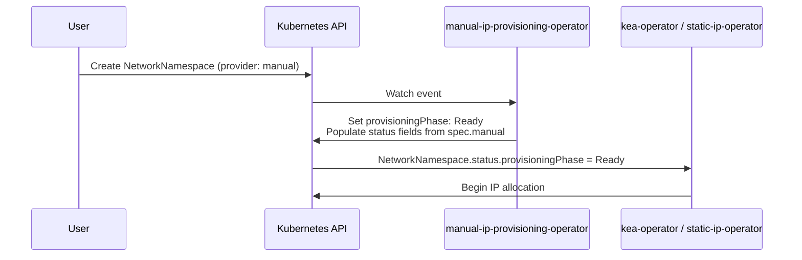

# Manual IP Provisioning Operator

The `manual-ip-provisioning-operator` handles network provisioning for `NetworkNamespace` resources configured with `networkProvisioning.provider: manual`.

## Purpose

In environments where network segments (IP prefixes, VLANs) are managed externally — for example by a network team, an enterprise IPAM system, or pre-existing infrastructure — the manual provisioning operator allows users to supply this information directly in the `NetworkNamespace` spec rather than relying on an automated provisioning backend.

## How It Works



1. User creates a `NetworkNamespace` with `spec.networkProvisioning.provider: manual`
2. The operator reads the manual configuration (`ipv4CIDR`, `ipv4Gateway`, `vlanId`)
3. Populates `status` fields (`ipv4Prefix`, `vlanId`, etc.) from the manual config
4. Sets `status.provisioningPhase: Ready`
5. Downstream operators (kea-operator, static-ip-operator) detect `Ready` and begin

## Configuration

The operator requires no special configuration. It watches all `NetworkNamespace` resources and only acts on those with `spec.networkProvisioning.provider: manual`.

## Installation

```bash
helm install manual-ip-provisioning-operator \
  oci://ghcr.io/vitistack/helm/manual-ip-provisioning-operator \
  --namespace vitistack-system
```

## Example

```yaml
apiVersion: vitistack.io/v1alpha2
kind: NetworkNamespace
metadata:
  name: lab-network
  namespace: datacenter-01
spec:
  datacenterIdentifier: no-west-az1
  supervisorIdentifier: lab-01
  networkProvisioning:
    provider: manual
    manual:
      ipv4CIDR: "192.168.10.0/24"
      ipv4Gateway: "192.168.10.1"
      vlanId: 200
  ipAllocation:
    type: static
    provider: static-ip-operator
    static:
      ipv4CIDR: "192.168.10.0/24"
      ipv4Gateway: "192.168.10.1"
      ipv4RangeStart: "192.168.10.10"
      ipv4RangeEnd: "192.168.10.200"
      vlanId: 200
      dns:
        - "192.168.10.1"
```

After the operator reconciles:

```yaml
status:
  provisioningPhase: Ready
  ipv4Prefix: "192.168.10.0/24"
  vlanId: 200
  datacenterIdentifier: no-west-az1
  supervisorIdentifier: lab-01
  phase: Active
  status: OK
```

## Related

- [NetworkNamespace CRD](../crd/networknamespace.md)
- [IPAllocation CRD](../crd/ipallocation.md)
- [Static IP Operator](../operators/ipam-operator.md)
