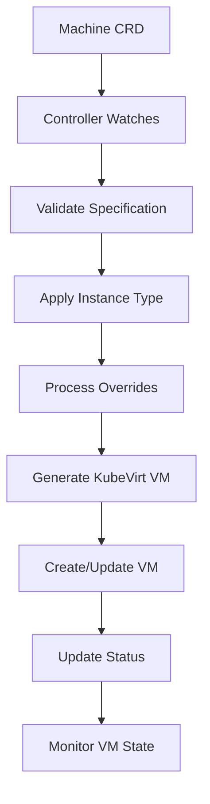

# Viti KubeVirt Operator

!!! warning "Work in progress!"

The Viti KubeVirt Operator is a Kubernetes operator that simplifies the creation and management of virtual machines using KubeVirt technology. It provides a high-level abstraction over KubeVirt's native `VirtualMachine` resources through custom `Machine` CRDs, making VM management more accessible and standardized within the Viti ecosystem.

## Overview

KubeVirt is a Kubernetes add-on that allows you to run virtual machines alongside containerized workloads in the same cluster. The Viti KubeVirt Operator builds on this foundation by providing:

- **Simplified VM Definitions**: High-level `Machine` CRDs instead of complex KubeVirt manifests
- **Predefined Instance Types**: Standard small, medium, and large configurations
- **Resource Override Capabilities**: Fine-grained control when needed
- **Declarative Management**: GitOps-friendly VM lifecycle management
- **Viti Integration**: Consistent API patterns across the Viti platform

## Architecture

### Core Components

#### 1. **Controller Manager** (`cmd/`)
- **Main Entry Point**: Initializes and manages the operator controllers
- **Event Processing**: Handles Kubernetes API events for Machine resources
- **Reconciliation Loop**: Continuously ensures desired state matches actual state

#### 2. **Custom Resource Definitions** (`config/crd/`)
The operator defines the primary resource:

- **`Machine`**: High-level abstraction for virtual machines

#### 3. **Controllers** (`controllers/v1alpha1/`)
- **Machine Controller**: Main reconciler for Machine resources
- **State Management**: Handles VM creation, updates, and deletion
- **Resource Translation**: Converts Machine specs to KubeVirt VirtualMachine resources

#### 4. **Internal Services** (`internal/` and `pkg/`)
- **VM Configuration Logic**: Business rules for virtual machine setup
- **KubeVirt Integration**: Direct interaction with KubeVirt APIs
- **Resource Calculation**: Handles instance type definitions and overrides

## How It Works

### 1. **Machine Resource Processing**



### 2. **Instance Type System**

The operator provides predefined instance types:

#### **Small Instance**
- **CPU**: 1 core, 1 socket, 1 thread per core
- **Memory**: 1 GB
- **Use Case**: Lightweight workloads, testing, development

#### **Medium Instance**
- **CPU**: 2 cores, 2 sockets, 1 thread per core  
- **Memory**: 2 GB
- **Use Case**: Standard applications, moderate workloads

#### **Large Instance**
- **CPU**: 4 cores, 2 sockets, 2 threads per core
- **Memory**: 4 GB
- **Use Case**: Resource-intensive applications, production workloads

### 3. **Resource Override Capability**

Users can override default instance type settings for fine-grained control:

- **CPU Configuration**: Cores, sockets, threads per core
- **Memory Allocation**: Custom memory sizes in bytes
- **Disk Configuration**: Additional storage volumes

## Configuration Examples

### 1. **Basic Small VM**
```yaml
apiVersion: vitistack.io/v1alpha1
kind: Machine
metadata:
  name: example-machine-small
spec:
  instanceType: "small"
  name: "example-vm-small"
```

### 2. **Small VM with Resource Overrides**
```yaml
apiVersion: vitistack.io/v1alpha1
kind: Machine
metadata:
  name: example-machine-custom
spec:
  instanceType: "small"
  name: "example-vm-custom"
  cpu:
    cores: 4
    sockets: 4
    threadsPerCore: 2
  memory: 4294967296  # 4 GB in bytes
```

### 3. **VM with Additional Disks**
```yaml
apiVersion: vitistack.io/v1alpha1
kind: Machine
metadata:
  name: example-machine-with-disks
spec:
  instanceType: "medium"
  name: "example-vm-storage"
  disks:
    - name: "data-disk"
      size: "10Gi"
      storageClass: "fast-ssd"
    - name: "backup-disk"
      size: "50Gi"
      storageClass: "standard"
```

## Key Features

### **Simplified Virtual Machine Management**
- **High-Level Abstraction**: No need to understand complex KubeVirt manifests
- **Standardized Configurations**: Predefined instance types for common use cases
- **Consistent API**: Follows Kubernetes resource patterns

### **Flexible Resource Configuration**
- **Instance Types**: Quick deployment with standard configurations
- **Override Capabilities**: Customize resources when defaults don't fit
- **Storage Management**: Support for multiple disk attachments

### **Production Ready**
- **Built with Kubebuilder**: Follows Kubernetes operator best practices
- **Helm Charts**: Easy deployment and configuration management
- **CI/CD Integration**: Automated testing and releases

### **Development Features**
- **Local Development**: Support for building with private dependencies
- **Multiple Build Methods**: SSH, Docker secrets, and build args support
- **Comprehensive Examples**: Various configuration patterns provided

## Installation and Deployment

### **Helm Installation**
The operator includes Helm charts (`charts/kubevirt-operator/`) with:

- **CRD Management**: Automatic custom resource definition installation
- **RBAC Setup**: Proper permissions for cluster operations
- **Operator Deployment**: Configurable operator pod deployment
- **Service Accounts**: Required service accounts and role bindings

### **Quick Start**
```bash
# 1. Deploy the operator
helm install kubevirt-operator oci://ghcr.io/vitistack/helm/kubevirt-operator

# 2. Create a virtual machine
kubectl apply -f examples/machine-small.yaml

# 3. Verify VM creation
kubectl get machines
kubectl get vms
```

### **Local Development Setup**
The operator supports local development with private repository dependencies:

```bash
# Using SSH (recommended)
make docker-build-with-ssh

# Using Docker secrets
export GITHUB_TOKEN=your_token_here
make docker-build-with-secrets
```

## Workflow

### 1. **Virtual Machine Creation**
1. **Submit Machine Resource**: Apply Machine CRD to Kubernetes
2. **Controller Detection**: Operator watches and detects new resource
3. **Instance Type Processing**: Apply predefined resource configurations
4. **Override Application**: Process any custom resource overrides
5. **KubeVirt Translation**: Generate appropriate VirtualMachine manifest
6. **VM Deployment**: Create the virtual machine in KubeVirt
7. **Status Monitoring**: Continuously monitor and report VM status

### 2. **Resource Management**
- **Scaling**: Modify resource specifications and apply changes
- **Updates**: Change instance types or override configurations
- **Lifecycle**: Start, stop, restart virtual machines as needed

### 3. **Storage Management**
- **Persistent Volumes**: Attach multiple disks to VMs
- **Storage Classes**: Use different storage types (SSD, HDD, etc.)
- **Dynamic Provisioning**: Automatic volume creation based on specifications

## Integration Benefits

### **KubeVirt Abstraction**
- **Simplified Management**: Hide KubeVirt complexity behind intuitive APIs
- **Standard Patterns**: Familiar Kubernetes resource management
- **Reduced Learning Curve**: Easy adoption for Kubernetes-familiar teams

### **Viti Ecosystem Integration**
- **Consistent APIs**: Follows Viti operator patterns and conventions
- **Multi-Provider Support**: Works alongside other Viti infrastructure operators
- **GitOps Ready**: Infrastructure-as-code compatible definitions

### **Enterprise Features**
- **Security Scanning**: Regular vulnerability assessments with govulncheck and CodeQL
- **Automated Releases**: Tagged releases trigger automatic builds and publishes
- **Dependency Management**: Automated updates via Dependabot

## Use Cases

### **Development and Testing**
- **Development VMs**: Quick deployment of development environments
- **Testing Isolation**: Isolated virtual machines for testing scenarios
- **Multi-OS Support**: Run different operating systems alongside containers

### **Legacy Application Support**
- **Migration Bridge**: Run legacy applications while containerizing gradually
- **OS Dependencies**: Support applications requiring specific OS versions
- **Gradual Modernization**: Hybrid deployment strategies

### **Specialized Workloads**
- **Security Isolation**: Enhanced isolation for sensitive workloads
- **Resource Intensive Applications**: VMs for applications needing dedicated resources
- **Windows Workloads**: Support for Windows-based applications in Kubernetes

!!! info "KubeVirt Technology"
    KubeVirt extends Kubernetes to support virtual machine workloads:
    
    - **Native Integration**: VMs managed as Kubernetes resources
    - **Shared Infrastructure**: VMs and containers on same nodes
    - **Unified Management**: Single control plane for all workloads
    - **Live Migration**: Move VMs between nodes without downtime
    - **Storage Integration**: Leverage Kubernetes persistent volumes