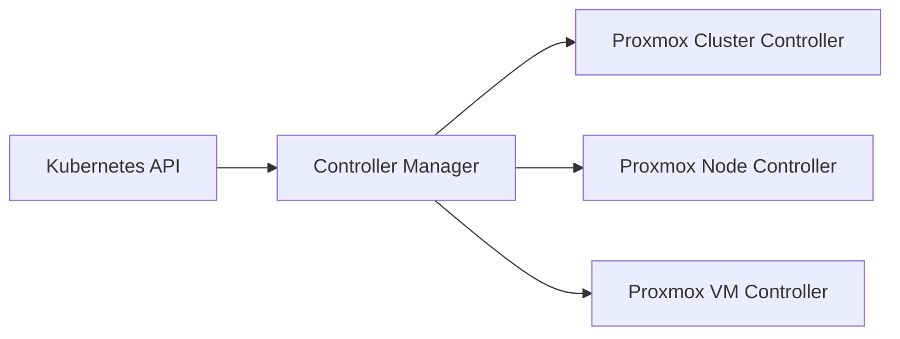

# Viti Proxmox Operator

The Viti Proxmox Operator is a Kubernetes operator that manages Proxmox Virtual Environment (PVE) resources through Kubernetes Custom Resource Definitions (CRDs). It enables declarative management of Proxmox clusters, nodes, and virtual machines directly from Kubernetes.

## Overview

The Proxmox operator bridges the gap between Kubernetes orchestration and Proxmox virtualization infrastructure, allowing you to:

- **Manage Proxmox clusters** as Kubernetes resources
- **Provision and manage virtual machines** declaratively
- **Monitor Proxmox node health** and status
- **Integrate Proxmox into GitOps workflows**

## Architecture

### Core Components

#### 1. **Controller Manager**
- **Location**: `cmd/` directory
- **Function**: Main entry point that starts the operator and manages all controllers
- **Responsibilities**: 
  - Initialize Kubernetes client
  - Start controller loops
  - Handle graceful shutdown

#### 2. **Custom Resource Definitions (CRDs)**
- **Location**: `config/crd/` directory
- **Function**: Define custom Kubernetes resources for Proxmox entities
- **Likely Resources**:
  - `ProxmoxCluster` - Represents a Proxmox cluster
  - `ProxmoxNode` - Represents individual Proxmox nodes
  - `ProxmoxVirtualMachine` - Represents VMs in Proxmox

#### 3. **Controllers**
- **Location**: `internal/controller/` directory
- **Function**: Implement reconciliation logic for each custom resource
- **Pattern**: Each controller watches for changes to its respective CRD and reconciles the desired state

#### 4. **Services**
- **Location**: `internal/services/` directory
- **Function**: Business logic for interacting with Proxmox API
- **Components**:
  - `initializeservice/` - Likely handles initial setup and configuration

## How It Works

### 1. **Resource Watching**


### 2. **Reconciliation Loop**
For each custom resource, the operator follows this pattern:

1. **Watch**: Monitor Kubernetes API for resource changes
2. **Compare**: Compare desired state (CRD spec) vs actual state (Proxmox status)
3. **Reconcile**: Make API calls to Proxmox to align actual state with desired state
4. **Update**: Update the resource status in Kubernetes

### 3. **Proxmox API Integration**
The operator communicates with Proxmox VE through its REST API to:
- **Create/Delete VMs**: Provision new virtual machines or remove existing ones
- **Modify VM Configuration**: Change CPU, memory, disk, network settings
- **Monitor Status**: Check VM running state, resource usage
- **Manage Node Health**: Monitor cluster node availability and health

## Typical Workflow

### 1. **Deploy a Virtual Machine**
```yaml
apiVersion: proxmox.vitistack.io/v1alpha1
kind: ProxmoxVirtualMachine
metadata:
  name: my-vm
  namespace: default
spec:
  cluster: "my-proxmox-cluster"
  node: "proxmox-node-1"
  vmid: 100
  template: "ubuntu-20.04"
  resources:
    cpu: 2
    memory: "4Gi"
    disk: "20Gi"
  network:
    - bridge: "vmbr0"
      model: "virtio"
```

### 2. **Controller Actions**
1. **Detect Change**: Controller notices new `ProxmoxVirtualMachine` resource
2. **Validate**: Check if target cluster and node exist
3. **Create VM**: Call Proxmox API to create the virtual machine
4. **Monitor**: Continuously check VM status and update Kubernetes resource
5. **Update Status**: Reflect actual VM state in the resource status

## Benefits

### **Declarative Management**
- Define desired state in YAML
- Operator ensures actual state matches desired state
- Version control your infrastructure

### **Kubernetes Integration**
- Use familiar `kubectl` commands
- Integrate with existing Kubernetes tooling
- RBAC and namespace isolation

### **GitOps Ready**
- Store configurations in Git
- Automated deployments through CI/CD
- Audit trail and rollback capabilities

## Installation

The operator is deployed using Helm charts located in `charts/proxmox-operator/` and includes:

- **Custom Resource Definitions**
- **RBAC configurations**
- **Deployment manifests**
- **Service accounts**
- **Network policies**
- **Prometheus monitoring** (optional)

## Configuration

Configuration is managed through:
- **Environment variables** for Proxmox API credentials
- **ConfigMaps** for cluster-specific settings
- **Secrets** for sensitive authentication data

!!! note "Development Status"
    This operator is actively developed and maintained by the Viti team. It follows Kubernetes operator best practices and is built using the Operator SDK framework.