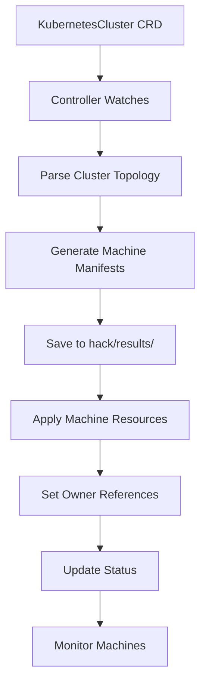

# Viti Talos Operator

!!! warning "Work in progress!"

The Viti Talos Operator is a Kubernetes operator designed to manage Talos Linux-based Kubernetes clusters declaratively. It automates the provisioning, configuration, and lifecycle management of Talos OS clusters through Kubernetes Custom Resource Definitions (CRDs).

## Overview

Talos Linux is a modern, secure, and minimal Linux distribution designed specifically for running Kubernetes. The Viti Talos Operator bridges the gap between Kubernetes orchestration and Talos cluster management, enabling:

- **Declarative Cluster Management**: Define entire Kubernetes clusters as YAML manifests
- **Automated Machine Provisioning**: Generate and manage individual machine configurations
- **Lifecycle Management**: Handle cluster creation, scaling, and deletion
- **GitOps Integration**: Version-controlled infrastructure with automated deployments

## Architecture

### Core Components

#### 1. **Controller Manager** (`cmd/`)
- **Main Entry Point**: Initializes and manages all operator controllers
- **Reconciliation Engine**: Runs continuous reconciliation loops
- **Event Handling**: Processes Kubernetes API events for custom resources

#### 2. **Custom Resource Definitions** (`config/crd/`)
The operator defines these primary resources:
- **`KubernetesCluster`**: High-level cluster specification
- **`Machine`**: Individual node configurations (generated automatically)

#### 3. **API Controllers** (`api/controllers/v1alpha1/`)
- **KubernetesCluster Controller**: Main reconciler for cluster resources
- **Machine Controller**: Manages individual Talos machines
- **Validation Logic**: Ensures resource specifications are valid

#### 4. **Internal Services** (`internal/`)
- **Cluster Management Logic**: Business rules for cluster operations
- **Talos API Integration**: Communication with Talos nodes
- **Configuration Generation**: Creates Talos machine configurations

## How It Works

### 1. **KubernetesCluster Reconciliation Process**



### 2. **Machine Generation Logic**

The operator analyzes the `KubernetesCluster` specification and automatically generates:

- **Control Plane Machines**: Based on `spec.topology.controlplane.replicas`
- **Worker Machines**: Based on `spec.topology.workers` configuration
- **Proper Labeling**: Ensures machines are correctly labeled for their roles
- **Owner References**: Links machines to the parent cluster for cleanup

### 3. **File Generation and Debugging**

A unique feature of this operator is its debugging capability:
- **Local File Output**: Saves all generated manifests to `hack/results/{cluster-name}/`
- **Manual Inspection**: Allows developers to review generated configurations
- **Troubleshooting**: Enables debugging of cluster generation logic

## Configuration Structure

### KubernetesCluster Resource Example

```yaml
apiVersion: vitistack.io/v1alpha1
kind: KubernetesCluster
metadata:
  name: simple-cluster
spec:
  data:
    clusterUid: "a30fbc8d-596f-48d0-8541-dbc23bca28a1"
    clusterId: "simple-cluster-id"
    provider: talos
    environment: dev
    datacenter: trd1
    project: simple-project
    region: west-trondelag
    workorder: "simple-workorder"
    zone: "Trøndelag"
    workspace: "simple-workspace"
  topology:
    version: "1.33"
    controlplane:
      replicas: 1
      version: "1.33"
    workers:
      - name: worker-pool-1
        replicas: 2
        version: "1.33"
```

### Key Specification Fields

#### **Metadata Section**
- **`clusterUid`**: Unique identifier for the cluster
- **`clusterId`**: Human-readable cluster identifier
- **`provider`**: Always "talos" for this operator
- **`environment`**: Deployment environment (dev, staging, prod)
- **`datacenter`**: Physical datacenter location
- **`region`**: Geographical region
- **`zone`**: Availability zone

#### **Topology Section**
- **`version`**: Kubernetes version to deploy
- **`controlplane.replicas`**: Number of control plane nodes
- **`workers`**: Array of worker node pools with their configurations

## Workflow

### 1. **Cluster Creation**
1. **Submit Manifest**: Apply `KubernetesCluster` resource to Kubernetes
2. **Controller Detection**: Operator detects new resource via watch
3. **Validation**: Validates cluster specification
4. **Machine Generation**: Creates individual `Machine` resources
5. **File Output**: Saves manifests to local filesystem for debugging
6. **Resource Application**: Applies generated machines to Kubernetes
7. **Status Updates**: Continuously monitors and reports cluster status

### 2. **Scaling Operations**
- **Scale Up**: Increase `replicas` in worker pools → Operator creates new machines
- **Scale Down**: Decrease `replicas` → Operator gracefully removes excess machines
- **Control Plane Scaling**: Modify `controlplane.replicas` for HA setups

### 3. **Cluster Deletion**
1. **Finalizer Processing**: Ensures graceful cleanup
2. **Machine Cleanup**: Removes all associated machines via owner references
3. **File Cleanup**: Removes generated files from filesystem
4. **Resource Removal**: Deletes the cluster resource

## Advanced Features

### **Finalizer Management**
- **Graceful Deletion**: Uses Kubernetes finalizers for controlled resource cleanup
- **Dependency Tracking**: Ensures machines are cleaned up before cluster removal
- **Error Handling**: Prevents resource leaks during failed operations

### **Owner References**
- **Automatic Cleanup**: Machines are automatically deleted when parent cluster is removed
- **Relationship Tracking**: Clear parent-child relationships in Kubernetes
- **Garbage Collection**: Leverages Kubernetes built-in garbage collection

### **Debugging Support**
- **Local File Generation**: All manifests saved to `hack/results/{cluster-name}/`
- **Manifest Inspection**: Review generated configurations before application
- **Development Workflow**: Supports iterative development and testing

## Installation and Usage

### **Quick Start**
```bash
# 1. Deploy the operator
make deploy IMG=ghcr.io/vitistack/talos-operator:latest

# 2. Create a cluster
kubectl apply -f examples/simple-kubernetescluster.yaml

# 3. Verify machines
kubectl get machines -l cluster.vitistack.io/cluster-name=simple-cluster

# 4. Check generated files
ls hack/results/simple-cluster/
```

### **Helm Installation**
The operator includes Helm charts (`charts/talos-operator/`) with:

- **CRD Installation**: Automatic custom resource definition setup
- **RBAC Configuration**: Proper service accounts and permissions
- **Deployment Manifests**: Operator deployment with configurable settings
- **Monitoring Integration**: Optional Prometheus metrics and alerts

## CI/CD Integration

### **Automated Releases**
- **Container Images**: Published to `ghcr.io/vitistack/talos-operator`
- **Helm Charts**: Available as OCI artifacts at `oci://ghcr.io/vitistack/helm/talos-operator`
- **Semantic Versioning**: Git tags trigger automated releases

### **Security and Quality**
- **Vulnerability Scanning**: Regular security scans with govulncheck and CodeQL
- **Dependency Management**: Automated updates via Dependabot
- **Testing Pipeline**: Comprehensive testing on each commit

## Integration with Viti Stack

The Talos Operator is a key component of the Viti infrastructure platform:

- **Multi-Provider Support**: Works alongside other Viti operators (Proxmox, Physical, etc.)
- **Consistent APIs**: Follows Viti conventions for cluster management
- **Monitoring Integration**: Built-in observability for cluster operations
- **GitOps Ready**: Designed for infrastructure-as-code workflows

!!! info "Talos Linux Benefits"
    Talos Linux provides several advantages for Kubernetes clusters:
    
    - **Immutable Infrastructure**: Read-only root filesystem prevents tampering
    - **API-Driven**: No SSH access, all management through secure APIs
    - **Minimal Attack Surface**: Purpose-built OS with only essential components
    - **Declarative Configuration**: All settings defined through machine configs
    - **Container Optimized**: Designed specifically for container workloads

